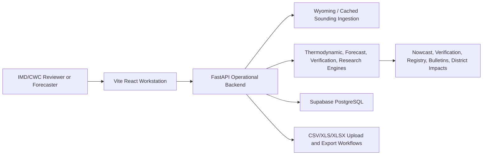
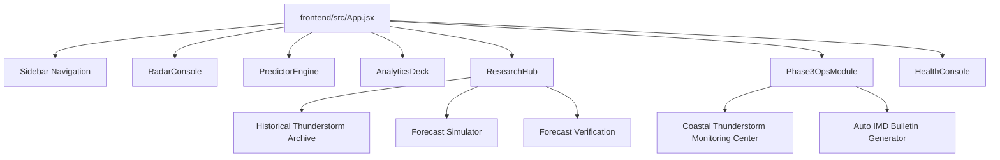
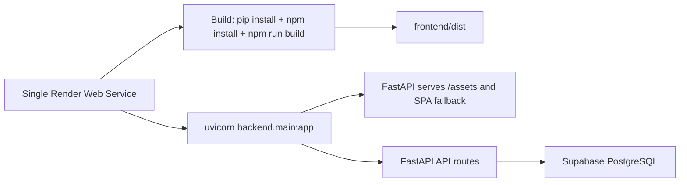
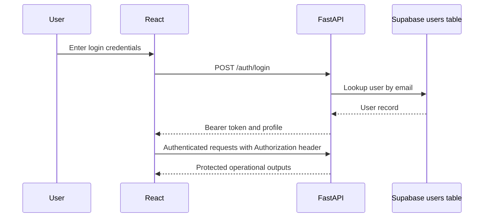
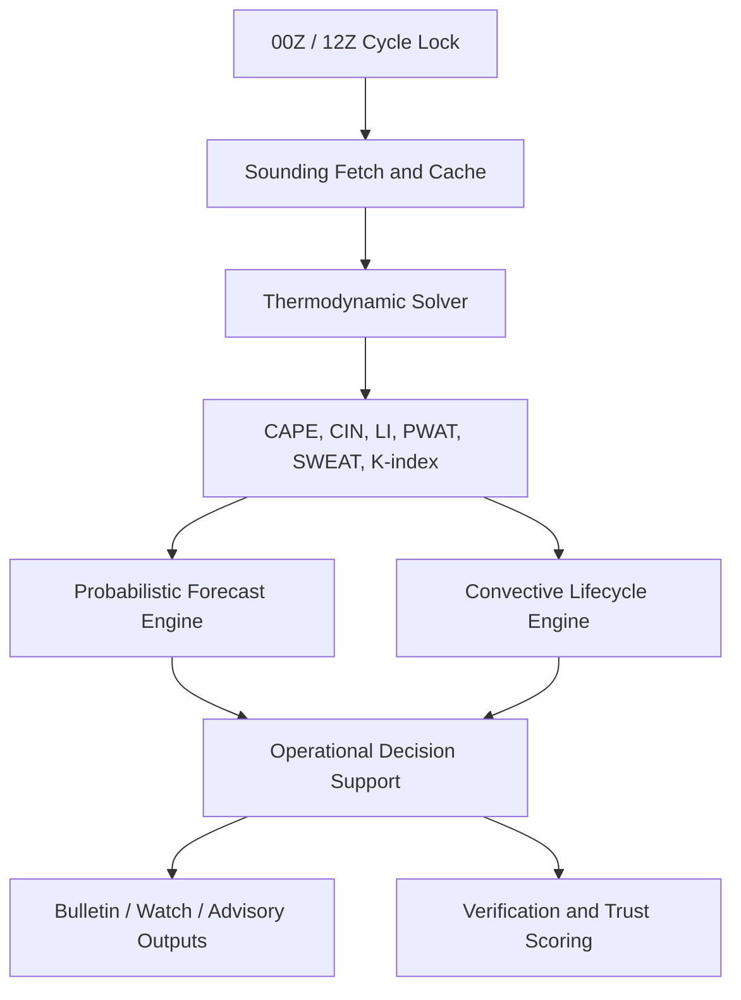

# Architecture Diagrams

Generated from repository inspection on 2026-06-08.

## High-Level Architecture

## Component Architecture

## Deployment Architecture

## Authentication Flow

## Forecast Pipeline

