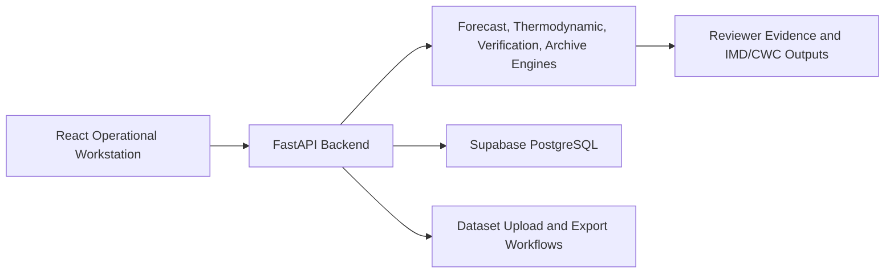

# StormSense AI MVP Documentation Version

Generated: 2026-06-08

## Purpose
This MVP version gives reviewers a compact first-read package before opening the full dossier. It focuses on what the platform is, how it is used, what evidence exists, and which workflows should be demonstrated.

## Executive Summary
StormSense AI is a FastAPI + Vite React operational thunderstorm decision-support workstation with 54 backend routes, 12 Supabase tables, 360 historical archive records, 240 observational records, and 46 supplied screenshot evidence files.

## Core Operational Workflows
| Workflow | Reviewer Action | Evidence |
| --- | --- | --- |
| Live Doppler/Radar Monitoring | Open Live Doppler Radar, confirm station and cycle metadata, inspect risk summary. | `RadarConsole.jsx`, screenshot evidence IMG-24 |
| Historical Archive | Open Historical Thunderstorm Archive, inspect latest event, archive counts, registry, and selected case. | `ResearchHub.jsx`, `/cwc/historical-dates`, IMG-33/IMG-45 |
| Forecast Simulator | Run or review custom sounding simulation and validation stages. | `/forecast`, `ResearchHub.jsx:FORECAST_LAB`, IMG-34/IMG-43 |
| File Analysis Center | Upload historical dataset and review quality/registry output. | `/cwc/analyze-historical-dataset`, IMG-23 |
| Verification | Recompute threshold scores and inspect contingency matrix. | `/cwc/verification`, IMG-21/IMG-22 |
| Reviewer Dashboard | Record case verdict and export review docket. | `ResearchHub.jsx:REVIEWER_DASHBOARD`, IMG-36 |

## System Architecture Snapshot

## Evidence Figures

### IMG-01 - Historical Workbench
Historical thunderstorm analysis center with file/date/station selectors and IMD review readiness panel.
Local file: `docs/screenshots/imd_evidence_01.png`

### IMG-02 - Historical Workbench
Review readiness and verification status panel with contingency metrics and analog confidence.
Local file: `docs/screenshots/imd_evidence_02.png`

### IMG-03 - Historical Workbench
Pipeline evidence trail showing data ingestion and sounding parsing sections.
Local file: `docs/screenshots/imd_evidence_03.png`

### IMG-04 - Historical Workbench
Index calculation cards for CAPE, CIN, LI, PWAT, SWEAT, K-index, shear, and theta-e.
Local file: `docs/screenshots/imd_evidence_04.png`

### IMG-05 - Historical Workbench
Collapsed workflow stages for threshold comparison, verification, interpretation, and recommendation.
Local file: `docs/screenshots/imd_evidence_05.png`

### IMG-06 - Forecast Simulator
Custom convective sounding forecast lab with thermodynamic slider inputs and simulated forecast outcome.
Local file: `docs/screenshots/imd_evidence_06.png`

### IMG-07 - Forecast Verification
Convective index threshold verification lab with threshold controls and contingency metrics.
Local file: `docs/screenshots/imd_evidence_07.png`

### IMG-08 - AI Prediction Engine
Probabilistic forecast envelope and operational analog match evidence.
Local file: `docs/screenshots/imd_evidence_08.png`

## Readiness Notes
- The full dossier contains complete API, database, design system, accessibility, security, testing, user, developer, and deployment documentation.
- The authoritative refreshed PDF is `StormSense_AI_IMD_Documentation_v2_1.pdf` because the older PDF filename was locked by another process during regeneration.

