# StormSense AI IMD/CWC Operational Documentation Dossier

Prepared for: IMD/CWC Review, Academic Submission, Internship Evaluation, Hackathon Presentation, Production Handover, Technical Review, and Deployment Documentation.

## Document Control

| Field | Value |
| --- | --- |
| Document Type | IMD/CWC operational review and production handover dossier |
| Evidence Basis | Supplied UI screenshots, frontend source code, backend source code, Supabase schema, generated migration/deployment reports, and historical archive files |
| Source Repository | C:\Users\USER\Thunderstorm analysis |
| Screenshot Evidence | 46 supplied screenshots copied into `docs/screenshots/` |
| Prepared Date | 2026-06-08 |

## Version History

| Version | Date | Summary |
| --- | --- | --- |
| 1.0 | Phase 2/3 | Deterministic convective forecasting, archive, verification, and operations modules. |
| 1.5 | Phase 5.9 | Reviewer polish, file analysis center, registry, typography, and deployment refinement. |
| 2.0 | 2026-06-08 | Supabase migration, single-URL Render deployment, and complete IMD/CWC documentation dossier. |
| 2.1 | 2026-06-08 | Screenshot-backed evidence catalogue, standalone audit deliverables, and front-matter simplified for reviewer use. |

## Acknowledgement
StormSense AI was developed as an operational atmospheric intelligence workstation focused on thunderstorm forecasting, verification, historical analysis, and IMD/CWC-style review workflows. The system integrates live/cached sounding ingestion, deterministic forecast engines, historical archives, verification science, and production deployment configuration.

## Executive Summary
StormSense AI is a FastAPI + Vite React atmospheric decision-support platform. Repository inspection found 91 source/data/runtime files under `backend/` and `frontend/src/`, 54 FastAPI route decorators, 12 Supabase schema tables, 360 RSRW historical archive records, and 240 IMD observational records. The application provides radar-like monitoring, deterministic forecast generation, historical thunderstorm archive workflows, file upload analysis, verification metrics, district impact intelligence, operational bulletins, review mode, and single-URL Render deployment.

## Table of Contents
1. Project Overview
2. System Architecture
3. Page-by-Page Documentation
4. Screenshot Evidence Catalogue
5. Research & Insights Documentation
6. Meteorological Glossary
7. Database Documentation
8. API Documentation
9. Deployment Documentation
10. Testing Documentation
11. User Manual
12. Developer Manual
13. IMD Demonstration Guide
14. Appendix: Project Inventory

# 1. Project Overview

## Introduction
StormSense AI is an IMD-style atmospheric intelligence platform designed to support severe weather monitoring and thunderstorm forecasting decisions. It combines operational frontend workstations with backend forecast, verification, archive, and research engines.

## Project Objectives
- Interpret sounding and historical weather datasets in operational terms.
- Produce deterministic thunderstorm forecasts and probability diagnostics.
- Verify forecasts scientifically using CSI, POD, FAR, HSS, and BIAS.
- Support IMD/CWC review through simplified review mode and reviewer dashboard.
- Preserve historical archive workflows for 2023, 2024, and 2025 records.
- Serve frontend and backend from one Render URL for production readiness.

## Problem Statement
Thunderstorm forecasting review requires a joined workflow: sounding interpretation, convective index calculation, forecast reasoning, observed-event verification, district impact assessment, and reviewer decision capture. Spreadsheet-only or display-only systems make it difficult to trace why a forecast was issued, whether it verified, and how thresholds should be tuned.

## Need for Thunderstorm Forecast Verification
Operational confidence depends on observed-event validation. StormSense AI provides contingency analysis, analog comparison, threshold reliability, archive case review, and probability traceability so that forecast behavior can be reviewed scientifically rather than treated as opaque dashboard output.

## IMD/CWC Operational Relevance
The system emphasizes Visakhapatnam, Machilipatnam, north coastal Andhra, radiosonde cycle metadata, district-level impact narratives, lightning/heavy rain/squall guidance, and operational bulletin workflows. It uses station codes, synoptic cycles, deterministic thresholds, and IMD-style terms throughout the review experience.

## Scope of StormSense AI
The platform covers live/cached sounding ingestion, forecast generation, radar-sounding-map fusion, historical archive analysis, file upload analysis, probabilistic forecasting, verification science, climatology, analog intelligence, reviewer dashboards, and single-service deployment.

## Key Capabilities
| Capability | Implementation Evidence |
| --- | --- |
| Live/cached sounding ingestion | `backend/fetch_sounding.py`, `/cwc/sounding-raw/{station_code}`, CAPE traceability metadata |
| Forecast engine | `backend/main.py`, `fetch_station_data`, `/forecast`, `PredictorEngine.jsx` |
| Verification science | `backend/analysis_engines.py`, `/cwc/verification`, `/cwc/threshold-research`, `ResearchHub.jsx` |
| Historical archive | `backend/data/rsrw_historical_archive.*`, `/cwc/historical-dates`, `ResearchHub.jsx:HISTORICAL_WORKBENCH` |
| File analysis center | `/cwc/analyze-historical-dataset`, `ResearchHub.jsx`, `Phase3OpsModule.jsx` |
| District impact | `compute_district_impact`, `/cwc/district-impact`, Andhra monitoring module |
| Single URL deployment | `render.yaml`, static serving in `backend/main.py` |

# 2. System Architecture

# Architecture Diagrams

Generated from repository inspection on 2026-06-08.

## High-Level Architecture

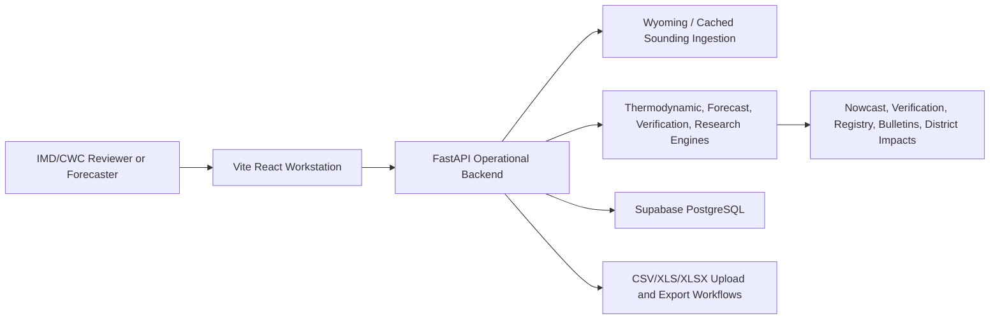

## Component Architecture

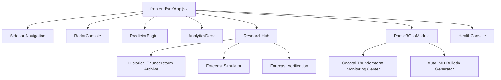

## Deployment Architecture

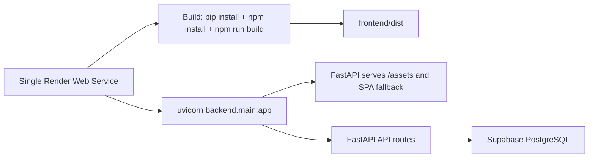

## Authentication Flow

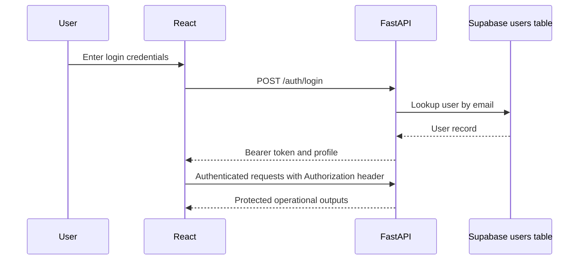

## Forecast Pipeline

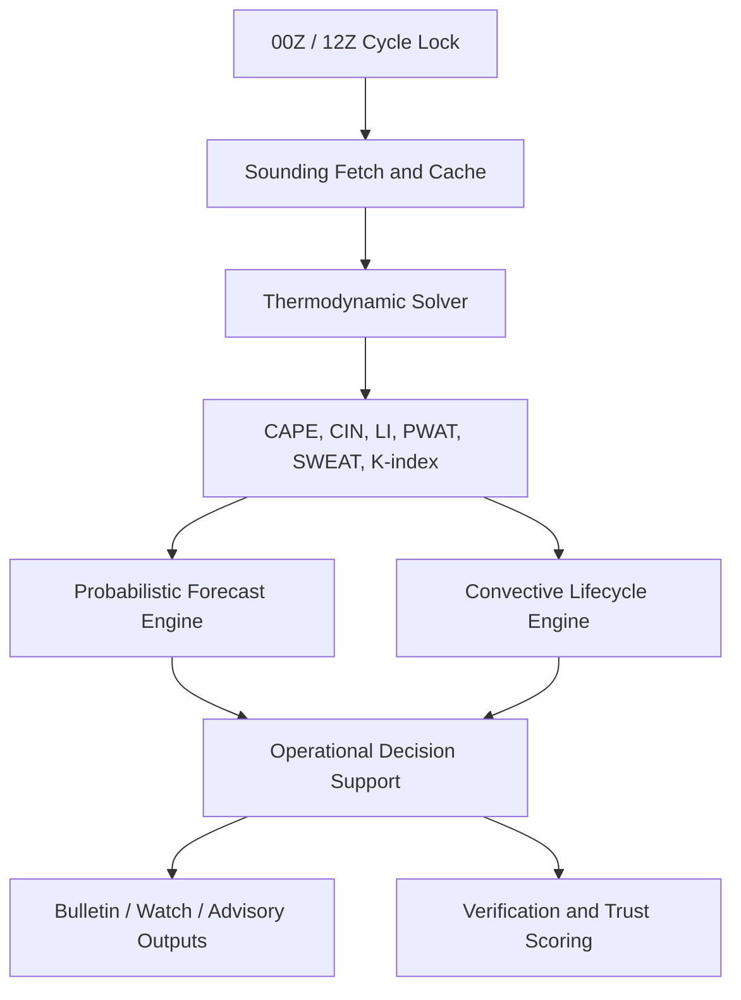

## Frontend Architecture
Primary navigation is implemented in `Sidebar.jsx` with 15 command deck entries. `App.jsx` manages authentication, review mode, forecast/historical/trend/escalation state, websocket connection, and module routing.

| Navigation ID | Visible Label |
| --- | --- |
| RADAR | Live Doppler Radar |
| PREDICTOR | AI Prediction Engine |
| ANALYTICS | Convective Analytics |
| RESEARCH | Research & Insights |
| HEALTH | Health & Migrations |
| ATM_INTEL | Atmospheric Intelligence Center |
| WATCHDESK | Severe Weather Watchdesk |
| THERMO_LAB | Thermodynamic Lab |
| CLIMO_RESEARCH | Climatology & Research Center |
| AI_LAB | Thunderstorm Forecast Simulator |
| RADSAT_FUSION | Live Operational Nowcast Center |
| VERIFY_CENTER | Forecast Verification |
| ANALOG_ARCHIVE | Historical Thunderstorm Archive |
| BULLETIN | Auto IMD Bulletin Generator |
| ANDHRA_MONITOR | Coastal Thunderstorm Monitoring Center |

## Backend Architecture
The FastAPI backend is centered in `backend/main.py`. It owns authentication routes, forecast routes, websocket stream, system status, CWC/research endpoints, file upload endpoints, and static frontend serving. Scientific logic is delegated to `analysis_engines.py`, `thermo.py`, and `fetch_sounding.py`.

## Engine Architecture
| Engine | Source | Role |
| --- | --- | --- |
| Thermodynamic solver | backend/thermo.py | Sounding parsing, CAPE/CIN/LCL/LFC/EL and parcel-path calculations. |
| Sounding ingestion | backend/fetch_sounding.py | Wyoming fetch, cache metadata, cycle-aware source status, freshness scoring. |
| Research and verification | backend/analysis_engines.py | Historical observations, contingency metrics, threshold research, probability, climatology, analogs, district impact. |
| Forecast orchestration | backend/main.py | Station forecast assembly, lifecycle, decision support, persistence, websocket output. |
| ML training artifact | backend/ml/train_model.py and storm_model.pkl | Random forest training script and model artifact for storm classification support. |

## Page-by-Page Documentation

| Page | Source Reference | Purpose | Primary Users | Inputs | Outputs |
| --- | --- | --- | --- | --- | --- |
| Dashboard / Operational Shell | frontend/src/App.jsx | Authenticated landing workspace that coordinates HUD status, station forecasts, websocket telemetry, and module routing. | Forecaster or reviewer. | Login token, forecast API payloads, websocket stream, cycle info. | Operational module views, HUD status, active cycle, and navigation context. |
| Live Doppler Radar | frontend/src/components/modules/RadarConsole.jsx | Radar-like operational visualization driven by forecast data, lifecycle state, lightning, rainfall, and station risk. | Nowcasting forecaster. | Forecast rows, storm probability, station metadata. | Operational radar console, severe markers, and monitoring interpretation. |
| AI Prediction Engine | frontend/src/components/modules/PredictorEngine.jsx | Station-level deterministic forecast workstation with convective index interpretation. | Forecast desk reviewer. | CAPE, LI, SWEAT, PWAT, K-index, cycle data. | Forecast classification, probability, trend, and action guidance. |
| Convective Analytics | frontend/src/components/modules/AnalyticsDeck.jsx | Verification, analytics, climatology, and decision-support panels. | Research analyst and verification reviewer. | Historical observations, thresholds, forecast rows. | Skill metrics, reliability, threshold insights, and forecast trust context. |
| Research & Insights | frontend/src/components/modules/ResearchHub.jsx | Multi-tab research center containing archive, simulator, verification, database, review, glossary, and onboarding pages. | Reviewer, researcher, and presenter. | Historical archive, upload file, selected station/date, thresholds. | Case analysis, registry, verification, dataset audit, and reviewer docket. |
| Historical Thunderstorm Archive | frontend/src/components/modules/ResearchHub.jsx:HISTORICAL_WORKBENCH | Flagship meteorological investigation console for historical thunderstorm records. | IMD/CWC reviewer. | 2023-2025 archive records, file upload, station/date filters. | Latest records, thunderstorm registry, archive summaries, exports, and historical analysis. |
| Thunderstorm Forecast Simulator | frontend/src/components/modules/ResearchHub.jsx:FORECAST_LAB | Historical and custom sounding forecast reproduction lab. | Forecaster and academic evaluator. | Station, date, custom sounding values, uploaded dataset. | Simulated forecast, threshold trace, probability, verification, and exportable report. |
| Forecast Verification | frontend/src/components/modules/ResearchHub.jsx:RESEARCH_VERIFY | Threshold testing and contingency-matrix verification workspace. | Verification scientist. | Thresholds, station, season, historical records. | CSI, POD, FAR, HSS, BIAS, and recommended calibration direction. |
| Dataset Explorer | frontend/src/components/modules/ResearchHub.jsx:DATASET_EXPLORER | Historical weather database browser. | Research analyst. | Archive index and selected station/date filters. | Weather archive log and searchable historical observations. |
| IMD Review Dashboard | frontend/src/components/modules/ResearchHub.jsx:REVIEWER_DASHBOARD | Reviewer docket and operational review console. | Reviewer or evaluator. | Selected event, reviewer name, docket ID, comments. | Review summary, verdict, action, export metadata. |
| About StormSense AI | frontend/src/components/modules/ResearchHub.jsx:ABOUT | Operational reference page for purpose, workflow, data sources, architecture, and outputs. | Reviewer and evaluator. | Static project metadata and workflow descriptions. | Architecture and operational purpose narrative. |
| Start Here | frontend/src/components/modules/ResearchHub.jsx:START_HERE | Reviewer onboarding center. | First-time reviewer. | None beyond app state. | Data requirements, outputs, common review flow, and quick navigation. |
| File Analysis Center | frontend/src/components/modules/ResearchHub.jsx and Phase3OpsModule.jsx | Upload and audit historical datasets. | Research analyst and reviewer. | CSV, XLS, XLSX, radiosonde, and sounding datasets. | Quality summary, column detection, registry, verification, and report exports. |
| Operational Monitoring | frontend/src/components/modules/Phase3OpsModule.jsx | Severe watchdesk, Andhra monitoring, radar-sounding fusion, and operational intelligence modules. | Nowcasting desk. | Forecast data, lifecycle state, station focus, district selection. | Monitoring recommendation, district impacts, and severe-weather guidance. |
| Bulletin Generator | frontend/src/components/modules/Phase3OpsModule.jsx:BULLETIN | Operational bulletin generation workspace. | Forecaster preparing advisory text. | Current forecast rows and cycle metadata. | Thunderstorm nowcasts, lightning advisories, heavy rainfall bulletins, and district summaries. |
| Health & Migrations | frontend/src/components/modules/HealthConsole.jsx | Deployment/runtime health and migration visibility console. | Developer/operator. | API base URL, websocket URL, system status. | Backend health, connectivity, and deployment readiness status. |

Screenshot evidence note: 46 supplied UI screenshots are copied under `docs/screenshots/` and catalogued in `SCREENSHOT_ANALYSIS_REPORT.md`.

### Dashboard / Operational Shell
Source reference: `frontend/src/App.jsx`.
Purpose: Authenticated landing workspace that coordinates HUD status, station forecasts, websocket telemetry, and module routing.
Who uses it: Forecaster or reviewer.
Inputs: Login token, forecast API payloads, websocket stream, cycle info.
Outputs: Operational module views, HUD status, active cycle, and navigation context.
Workflow: open the page from the sidebar or Research & Insights tab, confirm the operational metadata HUD, select station/date/cycle or file where applicable, review the current situation, meteorological interpretation, and recommended action, then export or record the reviewer verdict when the workflow supports it.
Operational relevance: this page contributes to the decision chain by answering what is happening, why it is happening, what may happen next, and what operational action should be taken.
Example usage: during IMD/CWC review, demonstrate the page with Visakhapatnam and Machilipatnam focus where station selection is available, then connect the visible output to the relevant backend endpoint or archive record.
Screenshot reference: see the screenshot evidence catalogue and `SCREENSHOT_ANALYSIS_REPORT.md` for matching supplied UI evidence.

### Live Doppler Radar
Source reference: `frontend/src/components/modules/RadarConsole.jsx`.
Purpose: Radar-like operational visualization driven by forecast data, lifecycle state, lightning, rainfall, and station risk.
Who uses it: Nowcasting forecaster.
Inputs: Forecast rows, storm probability, station metadata.
Outputs: Operational radar console, severe markers, and monitoring interpretation.
Workflow: open the page from the sidebar or Research & Insights tab, confirm the operational metadata HUD, select station/date/cycle or file where applicable, review the current situation, meteorological interpretation, and recommended action, then export or record the reviewer verdict when the workflow supports it.
Operational relevance: this page contributes to the decision chain by answering what is happening, why it is happening, what may happen next, and what operational action should be taken.
Example usage: during IMD/CWC review, demonstrate the page with Visakhapatnam and Machilipatnam focus where station selection is available, then connect the visible output to the relevant backend endpoint or archive record.
Screenshot reference: see the screenshot evidence catalogue and `SCREENSHOT_ANALYSIS_REPORT.md` for matching supplied UI evidence.

### AI Prediction Engine
Source reference: `frontend/src/components/modules/PredictorEngine.jsx`.
Purpose: Station-level deterministic forecast workstation with convective index interpretation.
Who uses it: Forecast desk reviewer.
Inputs: CAPE, LI, SWEAT, PWAT, K-index, cycle data.
Outputs: Forecast classification, probability, trend, and action guidance.
Workflow: open the page from the sidebar or Research & Insights tab, confirm the operational metadata HUD, select station/date/cycle or file where applicable, review the current situation, meteorological interpretation, and recommended action, then export or record the reviewer verdict when the workflow supports it.
Operational relevance: this page contributes to the decision chain by answering what is happening, why it is happening, what may happen next, and what operational action should be taken.
Example usage: during IMD/CWC review, demonstrate the page with Visakhapatnam and Machilipatnam focus where station selection is available, then connect the visible output to the relevant backend endpoint or archive record.
Screenshot reference: see the screenshot evidence catalogue and `SCREENSHOT_ANALYSIS_REPORT.md` for matching supplied UI evidence.

### Convective Analytics
Source reference: `frontend/src/components/modules/AnalyticsDeck.jsx`.
Purpose: Verification, analytics, climatology, and decision-support panels.
Who uses it: Research analyst and verification reviewer.
Inputs: Historical observations, thresholds, forecast rows.
Outputs: Skill metrics, reliability, threshold insights, and forecast trust context.
Workflow: open the page from the sidebar or Research & Insights tab, confirm the operational metadata HUD, select station/date/cycle or file where applicable, review the current situation, meteorological interpretation, and recommended action, then export or record the reviewer verdict when the workflow supports it.
Operational relevance: this page contributes to the decision chain by answering what is happening, why it is happening, what may happen next, and what operational action should be taken.
Example usage: during IMD/CWC review, demonstrate the page with Visakhapatnam and Machilipatnam focus where station selection is available, then connect the visible output to the relevant backend endpoint or archive record.
Screenshot reference: see the screenshot evidence catalogue and `SCREENSHOT_ANALYSIS_REPORT.md` for matching supplied UI evidence.

### Research & Insights
Source reference: `frontend/src/components/modules/ResearchHub.jsx`.
Purpose: Multi-tab research center containing archive, simulator, verification, database, review, glossary, and onboarding pages.
Who uses it: Reviewer, researcher, and presenter.
Inputs: Historical archive, upload file, selected station/date, thresholds.
Outputs: Case analysis, registry, verification, dataset audit, and reviewer docket.
Workflow: open the page from the sidebar or Research & Insights tab, confirm the operational metadata HUD, select station/date/cycle or file where applicable, review the current situation, meteorological interpretation, and recommended action, then export or record the reviewer verdict when the workflow supports it.
Operational relevance: this page contributes to the decision chain by answering what is happening, why it is happening, what may happen next, and what operational action should be taken.
Example usage: during IMD/CWC review, demonstrate the page with Visakhapatnam and Machilipatnam focus where station selection is available, then connect the visible output to the relevant backend endpoint or archive record.
Screenshot reference: see the screenshot evidence catalogue and `SCREENSHOT_ANALYSIS_REPORT.md` for matching supplied UI evidence.

### Historical Thunderstorm Archive
Source reference: `frontend/src/components/modules/ResearchHub.jsx:HISTORICAL_WORKBENCH`.
Purpose: Flagship meteorological investigation console for historical thunderstorm records.
Who uses it: IMD/CWC reviewer.
Inputs: 2023-2025 archive records, file upload, station/date filters.
Outputs: Latest records, thunderstorm registry, archive summaries, exports, and historical analysis.
Workflow: open the page from the sidebar or Research & Insights tab, confirm the operational metadata HUD, select station/date/cycle or file where applicable, review the current situation, meteorological interpretation, and recommended action, then export or record the reviewer verdict when the workflow supports it.
Operational relevance: this page contributes to the decision chain by answering what is happening, why it is happening, what may happen next, and what operational action should be taken.
Example usage: during IMD/CWC review, demonstrate the page with Visakhapatnam and Machilipatnam focus where station selection is available, then connect the visible output to the relevant backend endpoint or archive record.
Screenshot reference: see the screenshot evidence catalogue and `SCREENSHOT_ANALYSIS_REPORT.md` for matching supplied UI evidence.

### Thunderstorm Forecast Simulator
Source reference: `frontend/src/components/modules/ResearchHub.jsx:FORECAST_LAB`.
Purpose: Historical and custom sounding forecast reproduction lab.
Who uses it: Forecaster and academic evaluator.
Inputs: Station, date, custom sounding values, uploaded dataset.
Outputs: Simulated forecast, threshold trace, probability, verification, and exportable report.
Workflow: open the page from the sidebar or Research & Insights tab, confirm the operational metadata HUD, select station/date/cycle or file where applicable, review the current situation, meteorological interpretation, and recommended action, then export or record the reviewer verdict when the workflow supports it.
Operational relevance: this page contributes to the decision chain by answering what is happening, why it is happening, what may happen next, and what operational action should be taken.
Example usage: during IMD/CWC review, demonstrate the page with Visakhapatnam and Machilipatnam focus where station selection is available, then connect the visible output to the relevant backend endpoint or archive record.
Screenshot reference: see the screenshot evidence catalogue and `SCREENSHOT_ANALYSIS_REPORT.md` for matching supplied UI evidence.

### Forecast Verification
Source reference: `frontend/src/components/modules/ResearchHub.jsx:RESEARCH_VERIFY`.
Purpose: Threshold testing and contingency-matrix verification workspace.
Who uses it: Verification scientist.
Inputs: Thresholds, station, season, historical records.
Outputs: CSI, POD, FAR, HSS, BIAS, and recommended calibration direction.
Workflow: open the page from the sidebar or Research & Insights tab, confirm the operational metadata HUD, select station/date/cycle or file where applicable, review the current situation, meteorological interpretation, and recommended action, then export or record the reviewer verdict when the workflow supports it.
Operational relevance: this page contributes to the decision chain by answering what is happening, why it is happening, what may happen next, and what operational action should be taken.
Example usage: during IMD/CWC review, demonstrate the page with Visakhapatnam and Machilipatnam focus where station selection is available, then connect the visible output to the relevant backend endpoint or archive record.
Screenshot reference: see the screenshot evidence catalogue and `SCREENSHOT_ANALYSIS_REPORT.md` for matching supplied UI evidence.

### Dataset Explorer
Source reference: `frontend/src/components/modules/ResearchHub.jsx:DATASET_EXPLORER`.
Purpose: Historical weather database browser.
Who uses it: Research analyst.
Inputs: Archive index and selected station/date filters.
Outputs: Weather archive log and searchable historical observations.
Workflow: open the page from the sidebar or Research & Insights tab, confirm the operational metadata HUD, select station/date/cycle or file where applicable, review the current situation, meteorological interpretation, and recommended action, then export or record the reviewer verdict when the workflow supports it.
Operational relevance: this page contributes to the decision chain by answering what is happening, why it is happening, what may happen next, and what operational action should be taken.
Example usage: during IMD/CWC review, demonstrate the page with Visakhapatnam and Machilipatnam focus where station selection is available, then connect the visible output to the relevant backend endpoint or archive record.
Screenshot reference: see the screenshot evidence catalogue and `SCREENSHOT_ANALYSIS_REPORT.md` for matching supplied UI evidence.

### IMD Review Dashboard
Source reference: `frontend/src/components/modules/ResearchHub.jsx:REVIEWER_DASHBOARD`.
Purpose: Reviewer docket and operational review console.
Who uses it: Reviewer or evaluator.
Inputs: Selected event, reviewer name, docket ID, comments.
Outputs: Review summary, verdict, action, export metadata.
Workflow: open the page from the sidebar or Research & Insights tab, confirm the operational metadata HUD, select station/date/cycle or file where applicable, review the current situation, meteorological interpretation, and recommended action, then export or record the reviewer verdict when the workflow supports it.
Operational relevance: this page contributes to the decision chain by answering what is happening, why it is happening, what may happen next, and what operational action should be taken.
Example usage: during IMD/CWC review, demonstrate the page with Visakhapatnam and Machilipatnam focus where station selection is available, then connect the visible output to the relevant backend endpoint or archive record.
Screenshot reference: see the screenshot evidence catalogue and `SCREENSHOT_ANALYSIS_REPORT.md` for matching supplied UI evidence.

### About StormSense AI
Source reference: `frontend/src/components/modules/ResearchHub.jsx:ABOUT`.
Purpose: Operational reference page for purpose, workflow, data sources, architecture, and outputs.
Who uses it: Reviewer and evaluator.
Inputs: Static project metadata and workflow descriptions.
Outputs: Architecture and operational purpose narrative.
Workflow: open the page from the sidebar or Research & Insights tab, confirm the operational metadata HUD, select station/date/cycle or file where applicable, review the current situation, meteorological interpretation, and recommended action, then export or record the reviewer verdict when the workflow supports it.
Operational relevance: this page contributes to the decision chain by answering what is happening, why it is happening, what may happen next, and what operational action should be taken.
Example usage: during IMD/CWC review, demonstrate the page with Visakhapatnam and Machilipatnam focus where station selection is available, then connect the visible output to the relevant backend endpoint or archive record.
Screenshot reference: see the screenshot evidence catalogue and `SCREENSHOT_ANALYSIS_REPORT.md` for matching supplied UI evidence.

### Start Here
Source reference: `frontend/src/components/modules/ResearchHub.jsx:START_HERE`.
Purpose: Reviewer onboarding center.
Who uses it: First-time reviewer.
Inputs: None beyond app state.
Outputs: Data requirements, outputs, common review flow, and quick navigation.
Workflow: open the page from the sidebar or Research & Insights tab, confirm the operational metadata HUD, select station/date/cycle or file where applicable, review the current situation, meteorological interpretation, and recommended action, then export or record the reviewer verdict when the workflow supports it.
Operational relevance: this page contributes to the decision chain by answering what is happening, why it is happening, what may happen next, and what operational action should be taken.
Example usage: during IMD/CWC review, demonstrate the page with Visakhapatnam and Machilipatnam focus where station selection is available, then connect the visible output to the relevant backend endpoint or archive record.
Screenshot reference: see the screenshot evidence catalogue and `SCREENSHOT_ANALYSIS_REPORT.md` for matching supplied UI evidence.

### File Analysis Center
Source reference: `frontend/src/components/modules/ResearchHub.jsx and Phase3OpsModule.jsx`.
Purpose: Upload and audit historical datasets.
Who uses it: Research analyst and reviewer.
Inputs: CSV, XLS, XLSX, radiosonde, and sounding datasets.
Outputs: Quality summary, column detection, registry, verification, and report exports.
Workflow: open the page from the sidebar or Research & Insights tab, confirm the operational metadata HUD, select station/date/cycle or file where applicable, review the current situation, meteorological interpretation, and recommended action, then export or record the reviewer verdict when the workflow supports it.
Operational relevance: this page contributes to the decision chain by answering what is happening, why it is happening, what may happen next, and what operational action should be taken.
Example usage: during IMD/CWC review, demonstrate the page with Visakhapatnam and Machilipatnam focus where station selection is available, then connect the visible output to the relevant backend endpoint or archive record.
Screenshot reference: see the screenshot evidence catalogue and `SCREENSHOT_ANALYSIS_REPORT.md` for matching supplied UI evidence.

### Operational Monitoring
Source reference: `frontend/src/components/modules/Phase3OpsModule.jsx`.
Purpose: Severe watchdesk, Andhra monitoring, radar-sounding fusion, and operational intelligence modules.
Who uses it: Nowcasting desk.
Inputs: Forecast data, lifecycle state, station focus, district selection.
Outputs: Monitoring recommendation, district impacts, and severe-weather guidance.
Workflow: open the page from the sidebar or Research & Insights tab, confirm the operational metadata HUD, select station/date/cycle or file where applicable, review the current situation, meteorological interpretation, and recommended action, then export or record the reviewer verdict when the workflow supports it.
Operational relevance: this page contributes to the decision chain by answering what is happening, why it is happening, what may happen next, and what operational action should be taken.
Example usage: during IMD/CWC review, demonstrate the page with Visakhapatnam and Machilipatnam focus where station selection is available, then connect the visible output to the relevant backend endpoint or archive record.
Screenshot reference: see the screenshot evidence catalogue and `SCREENSHOT_ANALYSIS_REPORT.md` for matching supplied UI evidence.

### Bulletin Generator
Source reference: `frontend/src/components/modules/Phase3OpsModule.jsx:BULLETIN`.
Purpose: Operational bulletin generation workspace.
Who uses it: Forecaster preparing advisory text.
Inputs: Current forecast rows and cycle metadata.
Outputs: Thunderstorm nowcasts, lightning advisories, heavy rainfall bulletins, and district summaries.
Workflow: open the page from the sidebar or Research & Insights tab, confirm the operational metadata HUD, select station/date/cycle or file where applicable, review the current situation, meteorological interpretation, and recommended action, then export or record the reviewer verdict when the workflow supports it.
Operational relevance: this page contributes to the decision chain by answering what is happening, why it is happening, what may happen next, and what operational action should be taken.
Example usage: during IMD/CWC review, demonstrate the page with Visakhapatnam and Machilipatnam focus where station selection is available, then connect the visible output to the relevant backend endpoint or archive record.
Screenshot reference: see the screenshot evidence catalogue and `SCREENSHOT_ANALYSIS_REPORT.md` for matching supplied UI evidence.

### Health & Migrations
Source reference: `frontend/src/components/modules/HealthConsole.jsx`.
Purpose: Deployment/runtime health and migration visibility console.
Who uses it: Developer/operator.
Inputs: API base URL, websocket URL, system status.
Outputs: Backend health, connectivity, and deployment readiness status.
Workflow: open the page from the sidebar or Research & Insights tab, confirm the operational metadata HUD, select station/date/cycle or file where applicable, review the current situation, meteorological interpretation, and recommended action, then export or record the reviewer verdict when the workflow supports it.
Operational relevance: this page contributes to the decision chain by answering what is happening, why it is happening, what may happen next, and what operational action should be taken.
Example usage: during IMD/CWC review, demonstrate the page with Visakhapatnam and Machilipatnam focus where station selection is available, then connect the visible output to the relevant backend endpoint or archive record.
Screenshot reference: see the screenshot evidence catalogue and `SCREENSHOT_ANALYSIS_REPORT.md` for matching supplied UI evidence.

# 4. Screenshot Evidence Catalogue

## Screenshot Evidence Catalogue

Supplied screenshot evidence files copied into `docs/screenshots/`: 46.

| ID | UI Area | Evidence Summary | Local File |
| --- | --- | --- | --- |
| IMG-01 | Historical Workbench | Historical thunderstorm analysis center with file/date/station selectors and IMD review readiness panel. | docs/screenshots/imd_evidence_01.png |
| IMG-02 | Historical Workbench | Review readiness and verification status panel with contingency metrics and analog confidence. | docs/screenshots/imd_evidence_02.png |
| IMG-03 | Historical Workbench | Pipeline evidence trail showing data ingestion and sounding parsing sections. | docs/screenshots/imd_evidence_03.png |
| IMG-04 | Historical Workbench | Index calculation cards for CAPE, CIN, LI, PWAT, SWEAT, K-index, shear, and theta-e. | docs/screenshots/imd_evidence_04.png |
| IMG-05 | Historical Workbench | Collapsed workflow stages for threshold comparison, verification, interpretation, and recommendation. | docs/screenshots/imd_evidence_05.png |
| IMG-06 | Forecast Simulator | Custom convective sounding forecast lab with thermodynamic slider inputs and simulated forecast outcome. | docs/screenshots/imd_evidence_06.png |
| IMG-07 | Forecast Verification | Convective index threshold verification lab with threshold controls and contingency metrics. | docs/screenshots/imd_evidence_07.png |
| IMG-08 | AI Prediction Engine | Probabilistic forecast envelope and operational analog match evidence. | docs/screenshots/imd_evidence_08.png |
| IMG-09 | AI Prediction Engine | Operational meteorologist decision support and composite convective severity score. | docs/screenshots/imd_evidence_09.png |
| IMG-10 | Climatology & Research Center | Climatology and skill intelligence station view with seasonal recurrence composites. | docs/screenshots/imd_evidence_10.png |
| IMG-11 | Climatology & Research Center | Expanded climatology view showing station composite metrics and chart area. | docs/screenshots/imd_evidence_11.png |
| IMG-12 | Coastal Monitoring | Bay of Bengal coastal radar map focused on north coastal Andhra and station comparison. | docs/screenshots/imd_evidence_12.png |
| IMG-13 | Coastal Monitoring | Coastal Andhra intelligence stream with marine inflow and corridor metrics. | docs/screenshots/imd_evidence_13.png |
| IMG-14 | Research Navigation | Research & Soundings navigation stack with Dataset Explorer and Reviewer Audit Dashboard. | docs/screenshots/imd_evidence_14.png |
| IMG-15 | Dataset Explorer | IMD Convective Dataset Explorer distribution and ingestion audit panels. | docs/screenshots/imd_evidence_15.png |
| IMG-16 | Reviewer Dashboard | Reviewer audit dashboard empty-state prompt for historical analysis activation. | docs/screenshots/imd_evidence_16.png |
| IMG-17 | Forecast Verification | Verification lab loading state while contingency matrices are calculated. | docs/screenshots/imd_evidence_17.png |
| IMG-18 | Forecast Verification | Verification lab controls and calculation state in the Research & Soundings shell. | docs/screenshots/imd_evidence_18.png |
| IMG-19 | Dataset Explorer | Dataset Explorer metric cards and seeded historical records log. | docs/screenshots/imd_evidence_19.png |
| IMG-20 | Reviewer Dashboard | Reviewer audit dashboard prompt and reviewer workflow container. | docs/screenshots/imd_evidence_20.png |
| IMG-21 | Forecast Verification | Verification lab with computed CSI, POD, FAR, BIAS, HSS and case inspection log. | docs/screenshots/imd_evidence_21.png |
| IMG-22 | Forecast Verification | Computed verification lab with contingency matrix and operational decision advice. | docs/screenshots/imd_evidence_22.png |
| IMG-23 | File Analysis Center | Uploaded dataset quality summary showing records, missing values, duplicates, quality score, and station coverage. | docs/screenshots/imd_evidence_23.png |
| IMG-24 | Live Doppler Radar | IMD Visakhapatnam Cyclone Warning Centre radar console with operational metadata HUD. | docs/screenshots/imd_evidence_24.png |
| IMG-25 | AI Prediction Engine | Regional threat queue, CAPE traceability, probability evolution, and recommended actions. | docs/screenshots/imd_evidence_25.png |
| IMG-26 | AI Prediction Engine | Advanced diagnostics and scientific calibration blocks behind the operational summary. | docs/screenshots/imd_evidence_26.png |
| IMG-27 | AI Prediction Engine | Composite severity, lifecycle timeline, and decision-weight calibration controls. | docs/screenshots/imd_evidence_27.png |
| IMG-28 | Convective Analytics | Convective verification and threshold discovery hub with operational validation curves. | docs/screenshots/imd_evidence_28.png |
| IMG-29 | Convective Analytics | Historical convective sounding log table from CWC archives. | docs/screenshots/imd_evidence_29.png |
| IMG-30 | Operational Event Archive | Operational event archive cards for replaying historical severe weather scenarios. | docs/screenshots/imd_evidence_30.png |
| IMG-31 | Skew-T Sounding Plot | Thermodynamic Skew-T Log-P sounding profile with metadata and station selection. | docs/screenshots/imd_evidence_31.png |
| IMG-32 | Wyoming Sounding Data | University of Wyoming sounding archive view with source, cycle, cache age, and parameter decoder. | docs/screenshots/imd_evidence_32.png |
| IMG-33 | Historical Thunderstorm Archive | Archive summary with latest observed thunderstorm event, record counts, and latest record metadata. | docs/screenshots/imd_evidence_33.png |
| IMG-34 | Forecast Simulator | Custom sounding simulator with CAPE static-data warning and threshold comparison. | docs/screenshots/imd_evidence_34.png |
| IMG-35 | Dataset Explorer | CAPE dynamicity audit table and latest archive metrics. | docs/screenshots/imd_evidence_35.png |
| IMG-36 | Reviewer Dashboard | Reviewer audit dashboard with docket exports and reviewer verdict form. | docs/screenshots/imd_evidence_36.png |
| IMG-37 | Research Navigation | Research & Soundings navigation with Start Here, About, archive, simulator, verification, and learning pages. | docs/screenshots/imd_evidence_37.png |
| IMG-38 | Atmospheric Intelligence Center | Operational atmospheric intelligence center with station risk cards and interpretation. | docs/screenshots/imd_evidence_38.png |
| IMG-39 | Atmospheric Intelligence Center | Compact atmospheric intelligence view answering current situation and recommended context. | docs/screenshots/imd_evidence_39.png |
| IMG-40 | Severe Weather Watchdesk | Severe weather watchdesk with thunderstorm, heavy rain, lightning, squall, and stabilization indicators. | docs/screenshots/imd_evidence_40.png |
| IMG-41 | Thermodynamic Lab | Thermodynamic lab with CAPE, CIN, LCL, LFC, EL, parcel trace narrative, interpretation, and actions. | docs/screenshots/imd_evidence_41.png |
| IMG-42 | Climatology & Research Center | Climatology and research center with historical trust, Brier score, interpretation, and actions. | docs/screenshots/imd_evidence_42.png |
| IMG-43 | Thunderstorm Forecast Simulator | Operational forecast workspace with file analysis center steps and forecast metric cards. | docs/screenshots/imd_evidence_43.png |
| IMG-44 | Live Operational Nowcast Center | Nowcast center with coastal map markers and probability bars for thunderstorm, lightning, rain, and squall. | docs/screenshots/imd_evidence_44.png |
| IMG-45 | Historical Thunderstorm Archive | Historical archive summary with file analysis center and latest thunderstorm evidence. | docs/screenshots/imd_evidence_45.png |
| IMG-46 | Forecast Simulator | Simulator validation stages and CAPE static data warning evidence. | docs/screenshots/imd_evidence_46.png |

### Embedded Evidence Figures

#### IMG-01 - Historical Workbench
Historical thunderstorm analysis center with file/date/station selectors and IMD review readiness panel.

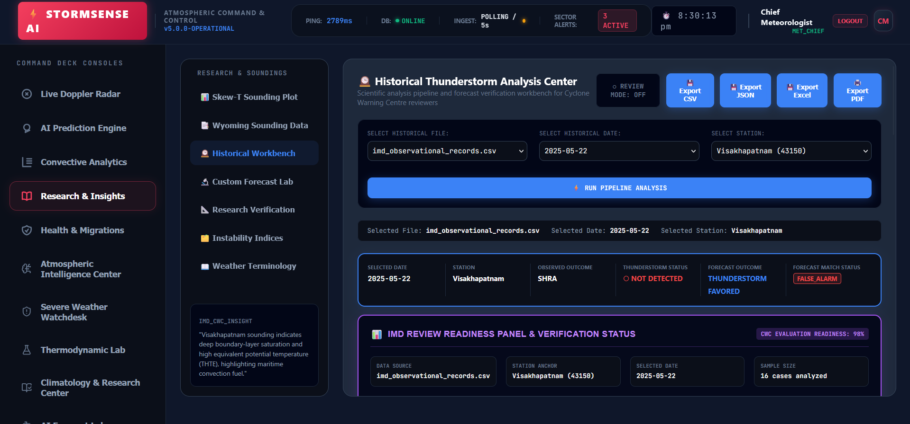

#### IMG-02 - Historical Workbench
Review readiness and verification status panel with contingency metrics and analog confidence.

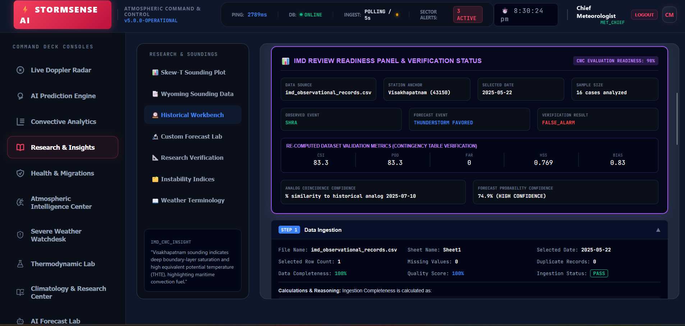

#### IMG-03 - Historical Workbench
Pipeline evidence trail showing data ingestion and sounding parsing sections.

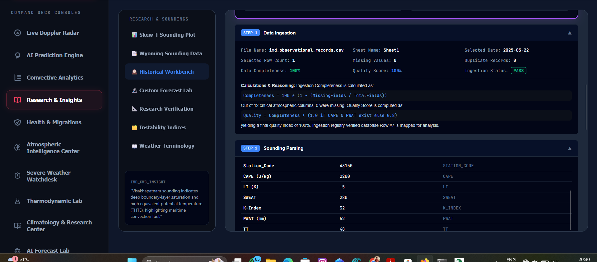

#### IMG-04 - Historical Workbench
Index calculation cards for CAPE, CIN, LI, PWAT, SWEAT, K-index, shear, and theta-e.

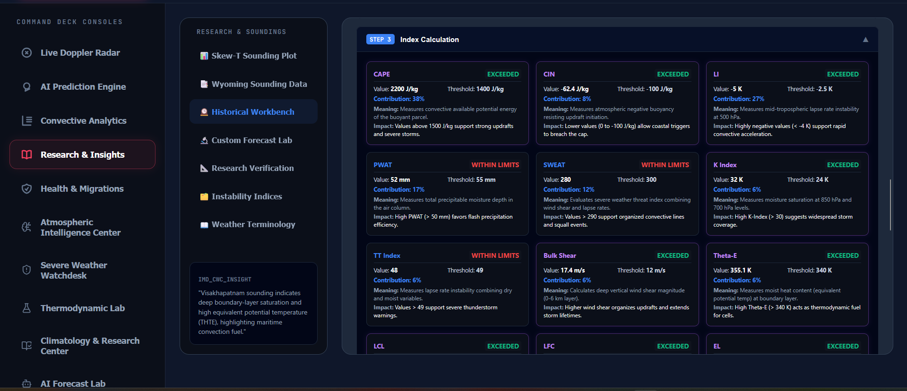

#### IMG-05 - Historical Workbench
Collapsed workflow stages for threshold comparison, verification, interpretation, and recommendation.

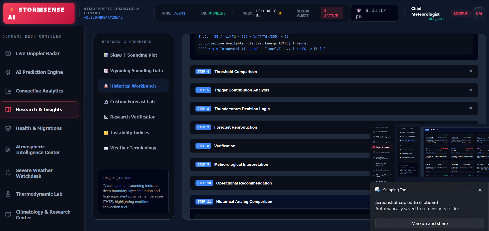

#### IMG-06 - Forecast Simulator
Custom convective sounding forecast lab with thermodynamic slider inputs and simulated forecast outcome.

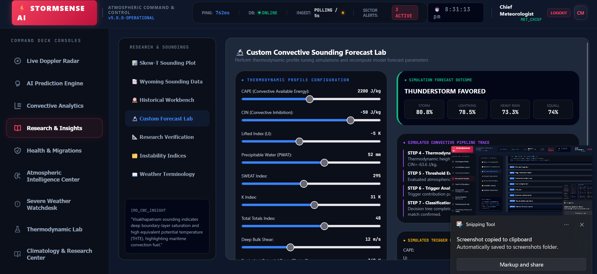

#### IMG-07 - Forecast Verification
Convective index threshold verification lab with threshold controls and contingency metrics.

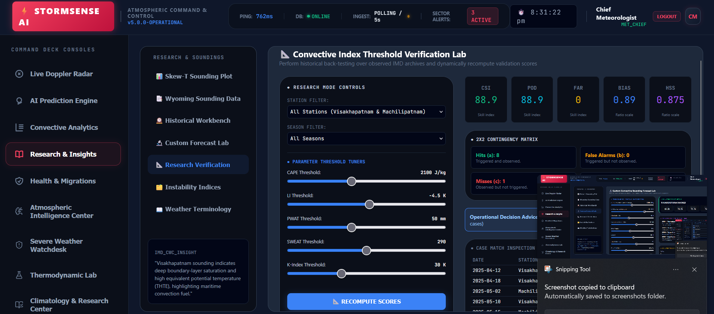

#### IMG-08 - AI Prediction Engine
Probabilistic forecast envelope and operational analog match evidence.

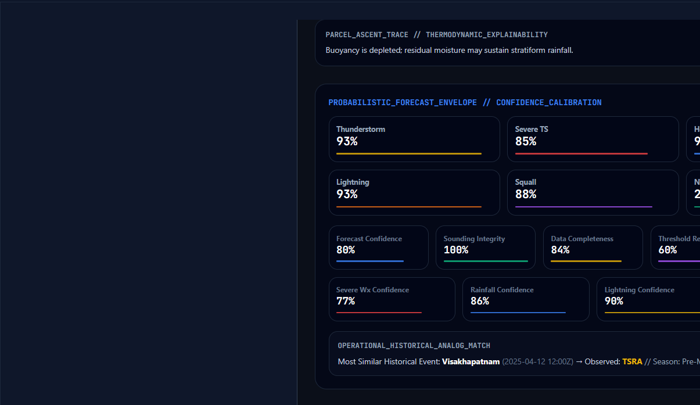

#### IMG-09 - AI Prediction Engine
Operational meteorologist decision support and composite convective severity score.

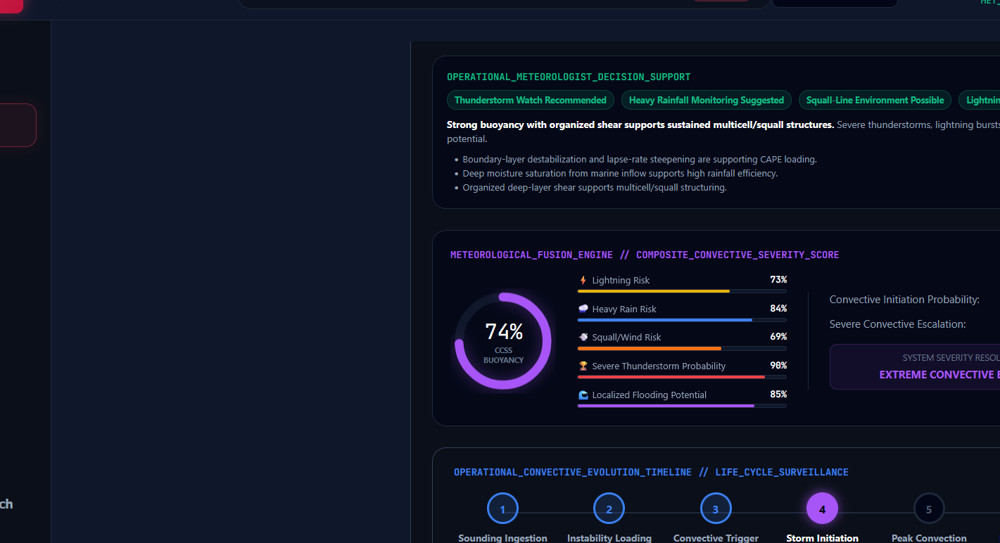

#### IMG-10 - Climatology & Research Center
Climatology and skill intelligence station view with seasonal recurrence composites.

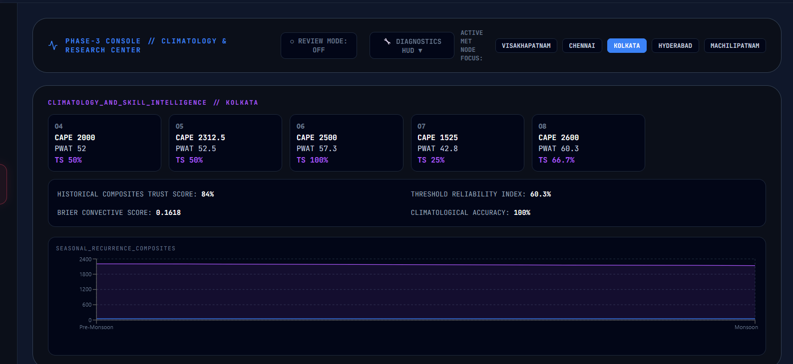

#### IMG-11 - Climatology & Research Center
Expanded climatology view showing station composite metrics and chart area.

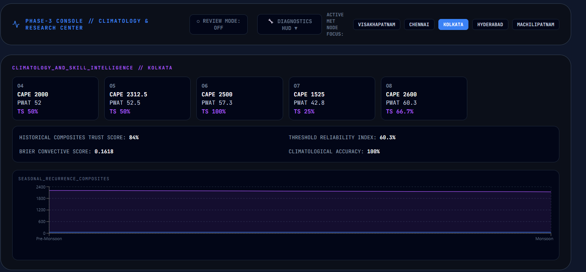

#### IMG-12 - Coastal Monitoring
Bay of Bengal coastal radar map focused on north coastal Andhra and station comparison.

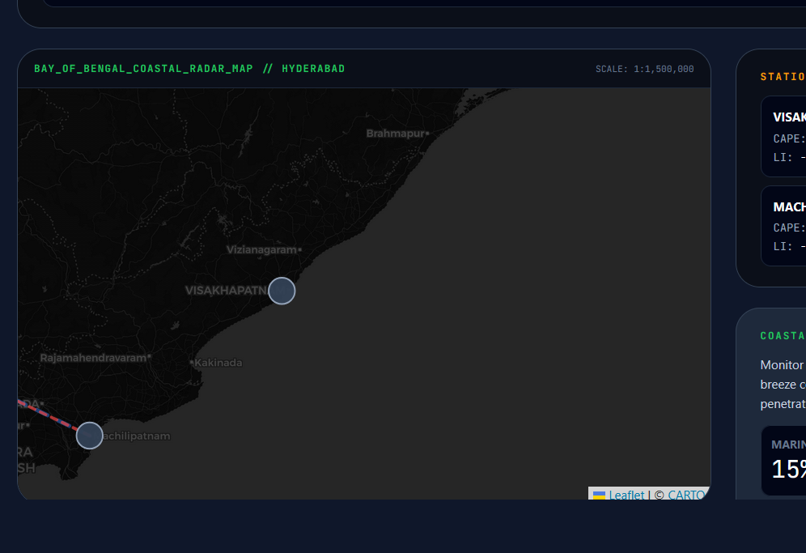

#### IMG-13 - Coastal Monitoring
Coastal Andhra intelligence stream with marine inflow and corridor metrics.

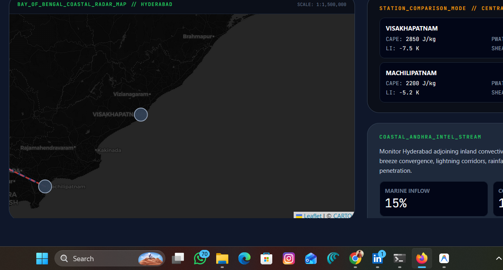

#### IMG-14 - Research Navigation
Research & Soundings navigation stack with Dataset Explorer and Reviewer Audit Dashboard.

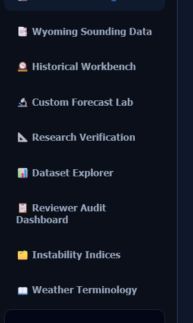

Additional screenshots are catalogued above and retained in `docs/screenshots/`; the main dossier embeds the first 14 representative figures to keep the PDF/DOCX readable.

# 5. Research & Insights Documentation

| Tab Code | Visible Page | Operational Function |
| --- | --- | --- |
| START_HERE | START HERE | Reviewer onboarding center for data requirements, outputs, and common review flow. |
| ABOUT | ABOUT STORMSENSE AI | Operational reference page describing purpose, architecture, data sources, and workflows. |
| SKEW_T | Skew-T / Thermodynamic Lab | Sounding visualization and thermodynamic parameter interpretation. |
| WYOMING_DATA | Wyoming Data | Radiosonde ingest and cycle-aware sounding review. |
| HISTORICAL_WORKBENCH | Historical Thunderstorm Archive | Flagship investigation console for 2023, 2024, and 2025 archive records. |
| FORECAST_LAB | Thunderstorm Forecast Simulator | Historical and custom sounding forecast reproduction and dataset analysis. |
| RESEARCH_VERIFY | Forecast Verification | Contingency metrics, threshold testing, and reviewer verification workflows. |
| DATASET_EXPLORER | Historical Weather Database | Historical weather database and archive exploration workspace. |
| REVIEWER_DASHBOARD | IMD Review Dashboard | Reviewer docket, verdict, and operational review workspace. |
| INDEX_GLOSSARY | Thunderstorm Indices Guide | Guide to CAPE, LI, SWEAT, PWAT, K-index, CIN, LCL, LFC, EL, and verification metrics. |
| TERMINOLOGY | Meteorology Learning Center | Operational terminology and learning support for reviewers. |

The Research & Insights module is the primary review and investigation area. It connects historical archive records, forecast simulation, verification, dataset upload analysis, thunderstorm registry, operational metadata, CAPE diagnostics, probability evolution, and reviewer workflow into a single operational research desk.

# 6. Meteorological Glossary

| Term | Operational Interpretation |
| --- | --- |
| CAPE | Convective Available Potential Energy. High CAPE indicates buoyant energy available for deep convection. Operationally, rising CAPE with sufficient moisture and weak inhibition increases thunderstorm potential. |
| CIN | Convective Inhibition. CIN represents the cap suppressing parcel ascent. Strong CIN can delay initiation even with high CAPE; weakening CIN can permit rapid thunderstorm development. |
| LI | Lifted Index. Negative LI indicates instability. Strong negative LI values support deep moist convection and severe updraft potential. |
| PWAT | Precipitable Water. High PWAT supports heavy rainfall efficiency, stratiform persistence, and flood susceptibility when forcing is present. |
| SWEAT | Severe Weather Threat Index. Combines instability, moisture, wind, and shear ingredients to indicate organized severe potential. |
| Bulk Shear | Vector wind difference through a layer, commonly 0-6 km. Higher shear supports storm organization, propagation, and persistent cells. |
| LCL | Lifted Condensation Level. Lower LCL indicates parcels reach saturation sooner, often supporting lower cloud bases and efficient convection. |
| LFC | Level of Free Convection. The level where an air parcel becomes positively buoyant and can accelerate upward. |
| EL | Equilibrium Level. The upper level where the parcel loses buoyancy; higher EL often implies taller storms and stronger echo tops. |
| Theta-E | Equivalent potential temperature. High theta-e in low levels marks warm, moist air and instability corridors. |
| Thunderstorm Initiation | The transition from conditional instability to active deep convection after lifting, convergence, heating, or boundary forcing overcomes inhibition. |
| Convective Instability | A thermodynamic profile capable of supporting deep convection when adequate lift and moisture are present. |
| CSI | Critical Success Index. Measures event forecast accuracy while penalizing misses and false alarms. |
| POD | Probability of Detection. Fraction of observed events that were correctly forecast. |
| FAR | False Alarm Ratio. Fraction of forecast events that did not occur; lower is better. |
| HSS | Heidke Skill Score. Skill score relative to random chance, useful for categorical forecast verification. |
| BIAS | Forecast frequency bias. Values greater than 1 indicate overforecasting; less than 1 indicates underforecasting. |

# 7. Database Documentation

StormSense AI uses Supabase PostgreSQL for production persistence. The schema is defined in `supabase_schema.sql` and initialized/accessed through SQLAlchemy helpers.

| Table | Columns |
| --- | --- |
| roles | id, name, description, created_at |
| users | id, name, email, password, role, created_at |
| profiles | id, user_id, auth_user_id, display_name, station_scope, created_at, updated_at |
| audit_login | id, user_id, email, status, detail, created_at |
| thunderstorm_forecasts | id, station, station_code, cape, lifted_index, sweat_index, k_index, pwat ... |
| historical_observations | id, record_date, observation_time, station, station_code, observed_event, source_file, source_sheet ... |
| historical_records | id, record_date, observation_time, station, station_code, observed_event, source_file, source_sheet ... |
| thunderstorm_registry | id, record_date, observation_time, station, station_code, observed_event, thunderstorm, nwx ... |
| verification_results | id, record_date, station, observed_event, forecast_result, verification_result, csi, hss ... |
| uploaded_datasets | id, file_name, storage_bucket, storage_path, total_records, thunderstorm_records, nwx_records, severe_storm_records ... |
| reviewer_dashboard_records | id, reviewer_id, docket_id, station, record_date, verdict, recommended_action, comments ... |
| audit_logs | id, action, status, detail, created_at |

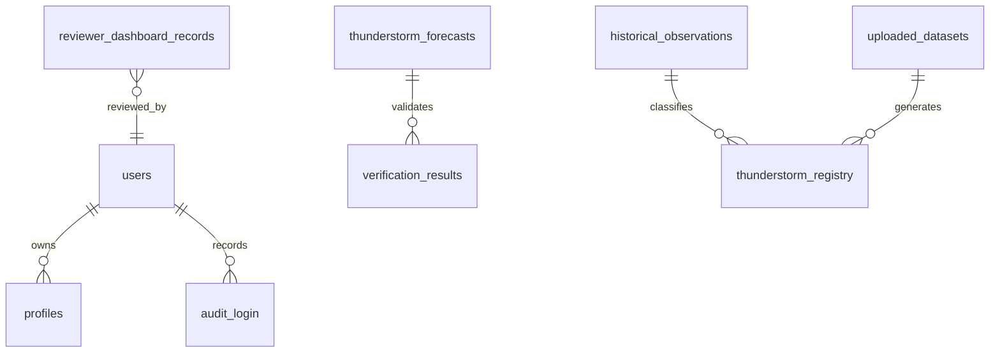

## Table-by-Table Supabase Notes

### roles
Role catalog for operational user classification.

| Column Definition |
| --- |
| id BIGINT GENERATED ALWAYS AS IDENTITY PRIMARY KEY |
| name VARCHAR(100) NOT NULL UNIQUE |
| description TEXT |
| created_at TIMESTAMP DEFAULT CURRENT_TIMESTAMP |

Review validation: confirm row count after migration, primary key behavior, nullable fields, and related frontend workflow visibility.

### users
Persisted application users migrated from the MySQL Workbench export and used by FastAPI authentication.

| Column Definition |
| --- |
| id BIGINT GENERATED BY DEFAULT AS IDENTITY PRIMARY KEY |
| name VARCHAR(255) NOT NULL |
| email VARCHAR(255) NOT NULL UNIQUE |
| password VARCHAR(255) NOT NULL |
| role VARCHAR(100) NOT NULL DEFAULT 'MET_CHIEF' |
| created_at TIMESTAMP DEFAULT CURRENT_TIMESTAMP |

Review validation: confirm row count after migration, primary key behavior, nullable fields, and related frontend workflow visibility.

### profiles
Optional profile extension table linked to users and future Supabase auth identifiers.

| Column Definition |
| --- |
| id BIGINT GENERATED ALWAYS AS IDENTITY PRIMARY KEY |
| user_id BIGINT REFERENCES users(id) ON DELETE CASCADE |
| auth_user_id UUID |
| display_name VARCHAR(255) |
| station_scope TEXT |
| created_at TIMESTAMP DEFAULT CURRENT_TIMESTAMP |
| updated_at TIMESTAMP DEFAULT CURRENT_TIMESTAMP |

Review validation: confirm row count after migration, primary key behavior, nullable fields, and related frontend workflow visibility.

### audit_login
Login audit trail recording successful and failed authentication attempts.

| Column Definition |
| --- |
| id BIGINT GENERATED ALWAYS AS IDENTITY PRIMARY KEY |
| user_id BIGINT REFERENCES users(id) ON DELETE SET NULL |
| email VARCHAR(255) |
| status VARCHAR(40) NOT NULL CHECK (status IN ('SUCCESS', 'FAILED', 'LOCKED', 'REVOKED')) |
| detail TEXT |
| created_at TIMESTAMP DEFAULT CURRENT_TIMESTAMP |

Review validation: confirm row count after migration, primary key behavior, nullable fields, and related frontend workflow visibility.

### thunderstorm_forecasts
Primary forecast persistence table containing station, indices, forecast class, probability, and created timestamp.

| Column Definition |
| --- |
| id BIGINT GENERATED BY DEFAULT AS IDENTITY PRIMARY KEY |
| station VARCHAR(255) |
| station_code VARCHAR(255) |
| cape DOUBLE PRECISION |
| lifted_index DOUBLE PRECISION |
| sweat_index DOUBLE PRECISION |
| k_index DOUBLE PRECISION |
| pwat DOUBLE PRECISION |
| forecast VARCHAR(255) |
| storm_probability INTEGER CHECK (storm_probability IS NULL OR storm_probability BETWEEN 0 AND 100) |
| created_at TIMESTAMP DEFAULT CURRENT_TIMESTAMP |

Review validation: confirm row count after migration, primary key behavior, nullable fields, and related frontend workflow visibility.

### historical_observations
Normalized historical observation records used by archive and verification workflows.

| Column Definition |
| --- |
| id BIGINT GENERATED ALWAYS AS IDENTITY PRIMARY KEY |
| record_date DATE |
| observation_time VARCHAR(40) |
| station VARCHAR(255) |
| station_code VARCHAR(50) |
| observed_event VARCHAR(100) |
| source_file TEXT |
| source_sheet TEXT |
| raw_json JSONB |
| created_at TIMESTAMP DEFAULT CURRENT_TIMESTAMP |

Review validation: confirm row count after migration, primary key behavior, nullable fields, and related frontend workflow visibility.

### historical_records
Historical record mirror/compatibility table for archive workflows.

| Column Definition |
| --- |
| id BIGINT GENERATED ALWAYS AS IDENTITY PRIMARY KEY |
| record_date DATE |
| observation_time VARCHAR(40) |
| station VARCHAR(255) |
| station_code VARCHAR(50) |
| observed_event VARCHAR(100) |
| source_file TEXT |
| source_sheet TEXT |
| raw_json JSONB |
| created_at TIMESTAMP DEFAULT CURRENT_TIMESTAMP |

Review validation: confirm row count after migration, primary key behavior, nullable fields, and related frontend workflow visibility.

### thunderstorm_registry
File/archive derived event registry with thunderstorm, NWX, severe storm, forecast, verification, and season flags.

| Column Definition |
| --- |
| id BIGINT GENERATED ALWAYS AS IDENTITY PRIMARY KEY |
| record_date DATE |
| observation_time VARCHAR(40) |
| station VARCHAR(255) |
| station_code VARCHAR(50) |
| observed_event VARCHAR(100) |
| thunderstorm BOOLEAN DEFAULT FALSE |
| nwx BOOLEAN DEFAULT FALSE |
| severe_storm BOOLEAN DEFAULT FALSE |
| forecast_result VARCHAR(255) |
| verification_result VARCHAR(100) |
| season VARCHAR(40) |
| source_dataset TEXT |
| created_at TIMESTAMP DEFAULT CURRENT_TIMESTAMP |

Review validation: confirm row count after migration, primary key behavior, nullable fields, and related frontend workflow visibility.

### verification_results
Forecast verification outputs, including CSI, HSS, POD, FAR, and BIAS.

| Column Definition |
| --- |
| id BIGINT GENERATED ALWAYS AS IDENTITY PRIMARY KEY |
| record_date DATE |
| station VARCHAR(255) |
| observed_event VARCHAR(100) |
| forecast_result VARCHAR(255) |
| verification_result VARCHAR(100) |
| csi DOUBLE PRECISION |
| hss DOUBLE PRECISION |
| pod DOUBLE PRECISION |
| far DOUBLE PRECISION |
| bias DOUBLE PRECISION |
| source_dataset TEXT |
| raw_json JSONB |
| created_at TIMESTAMP DEFAULT CURRENT_TIMESTAMP |

Review validation: confirm row count after migration, primary key behavior, nullable fields, and related frontend workflow visibility.

### uploaded_datasets
File Analysis Center persistence for upload metadata, quality score, and analysis JSON.

| Column Definition |
| --- |
| id BIGINT GENERATED ALWAYS AS IDENTITY PRIMARY KEY |
| file_name TEXT NOT NULL |
| storage_bucket TEXT |
| storage_path TEXT |
| total_records INTEGER DEFAULT 0 |
| thunderstorm_records INTEGER DEFAULT 0 |
| nwx_records INTEGER DEFAULT 0 |
| severe_storm_records INTEGER DEFAULT 0 |
| quality_score INTEGER DEFAULT 0 CHECK (quality_score BETWEEN 0 AND 100) |
| analysis_json JSONB |
| created_at TIMESTAMP DEFAULT CURRENT_TIMESTAMP |

Review validation: confirm row count after migration, primary key behavior, nullable fields, and related frontend workflow visibility.

### reviewer_dashboard_records
Reviewer docket, verdict, comments, station, date, and export metadata.

| Column Definition |
| --- |
| id BIGINT GENERATED ALWAYS AS IDENTITY PRIMARY KEY |
| reviewer_id TEXT |
| docket_id TEXT |
| station VARCHAR(255) |
| record_date DATE |
| verdict VARCHAR(100) |
| recommended_action TEXT |
| comments TEXT |
| export_storage_path TEXT |
| created_at TIMESTAMP DEFAULT CURRENT_TIMESTAMP |

Review validation: confirm row count after migration, primary key behavior, nullable fields, and related frontend workflow visibility.

### audit_logs
General operational audit log for migration and backend activity.

| Column Definition |
| --- |
| id BIGINT GENERATED ALWAYS AS IDENTITY PRIMARY KEY |
| action VARCHAR(100) NOT NULL |
| status VARCHAR(40) NOT NULL |
| detail TEXT |
| created_at TIMESTAMP DEFAULT CURRENT_TIMESTAMP |

Review validation: confirm row count after migration, primary key behavior, nullable fields, and related frontend workflow visibility.

# 8. API Documentation

Full API reference is also generated separately in `API_Reference.md`. Summary of discovered routes (54):

| Method | Route | Handler | Source |
| --- | --- | --- | --- |
| POST | /auth/signup | signup | backend/main.py:575 |
| POST | /auth/login | login | backend/main.py:613 |
| GET | /auth/me | auth_me | backend/main.py:703 |
| POST | /cwc/override | trigger_override | backend/main.py:711 |
| POST | /cwc/clear-override | clear_override | backend/main.py:732 |
| POST | /cwc/cycle | update_cycle | backend/main.py:754 |
| GET | /cwc/cycle | get_cycle | backend/main.py:765 |
| GET | / | home | backend/main.py:1558 |
| GET | /forecast | forecast | backend/main.py:1574 |
| GET | /history | history | backend/main.py:1592 |
| GET | /trend-analysis | trend_analysis | backend/main.py:1636 |
| GET | /storm-escalation | storm_escalation | backend/main.py:1670 |
| WEBSOCKET | /stream/atmospheric | stream_atmospheric | backend/main.py:1717 |
| GET | /system-status | system_status | backend/main.py:1769 |
| GET | /cwc/correlation | get_cwc_correlation | backend/main.py:1792 |
| GET | /cwc/optimization | get_cwc_optimization | backend/main.py:1796 |
| GET | /cwc/verification | get_cwc_verification | backend/main.py:1800 |
| GET | /cwc/thresholds | get_cwc_thresholds | backend/main.py:1804 |
| GET | /cwc/index-catalog | get_cwc_index_catalog | backend/main.py:1817 |
| GET | /cwc/seasonal-analysis | get_cwc_seasonal_analysis | backend/main.py:1821 |
| GET | /cwc/replay-cases | get_cwc_replay_cases | backend/main.py:1825 |
| GET | /cwc/observations | get_cwc_observations | backend/main.py:1829 |
| GET | /cwc/observational-analytics | get_cwc_observational_analytics | backend/main.py:1833 |
| GET | /cwc/probabilistic-forecast | get_cwc_probabilistic_forecast | backend/main.py:1837 |
| GET | /cwc/thermo-diagnostics | get_cwc_thermo_diagnostics | backend/main.py:1845 |
| GET | /cwc/verification-advanced | get_cwc_verification_advanced | backend/main.py:1901 |
| GET | /cwc/ml-ready-dataset | get_cwc_ml_ready_dataset | backend/main.py:1905 |
| GET | /cwc/climatology | get_cwc_climatology | backend/main.py:1909 |
| GET | /cwc/decision-support | get_cwc_decision_support | backend/main.py:1913 |
| GET | /cwc/operational-bulletins | get_cwc_operational_bulletins | backend/main.py:1967 |
| GET | /cwc/radar-sounding-fusion | get_cwc_radar_sounding_fusion | backend/main.py:1974 |
| GET | /cwc/ai-forecast-intelligence | get_cwc_ai_forecast_intelligence | backend/main.py:1993 |
| GET | /cwc/coastal-andhra-intelligence | get_cwc_coastal_andhra_intelligence | backend/main.py:2018 |
| GET | /cwc/verification-rolling | get_cwc_verification_rolling | backend/main.py:2042 |
| GET | /cwc/historical-observations | get_cwc_historical_observations | backend/main.py:2046 |
| GET | /cwc/export/csv | export_cwc_csv | backend/main.py:2050 |
| GET | /cwc/export/json | export_cwc_json | backend/main.py:2059 |
| GET | /cwc/ml-pipeline | get_cwc_ml_pipeline | backend/main.py:2063 |
| GET | /cwc/sounding-raw/{station_code} | get_cwc_sounding_raw | backend/main.py:2068 |
| GET | /cwc/threshold-research | get_cwc_threshold_research | backend/main.py:2090 |
| GET | /cwc/cape-traceability | get_cwc_cape_traceability | backend/main.py:2131 |
| GET | /cwc/analog | get_cwc_analog | backend/main.py:2176 |
| GET | /cwc/forecast-evolution | get_cwc_forecast_evolution | backend/main.py:2193 |
| GET | /cwc/district-impact | get_cwc_district_impact | backend/main.py:2203 |
| GET | /cwc/historical-files | get_cwc_historical_files | backend/main.py:2243 |
| GET | /cwc/historical-dates | get_cwc_historical_dates | backend/main.py:2440 |
| GET | /cwc/historical-analysis | get_cwc_historical_analysis | backend/main.py:2489 |
| POST | /cwc/upload-sounding | upload_sounding | backend/main.py:2802 |
| POST | /cwc/analyze-historical-dataset | analyze_historical_dataset | backend/main.py:2859 |
| GET | /cwc/latest-file-analyzed | get_latest_file_analyzed | backend/main.py:3082 |
| POST | /cwc/custom-sounding-analysis | custom_sounding_analysis | backend/main.py:3086 |
| POST | /cwc/research-verification | post_cwc_research_verification | backend/main.py:3167 |
| GET | /cwc/export/analysis | export_cwc_analysis | backend/main.py:3184 |
| GET | /{full_path:path} | serve_frontend_spa | backend/main.py:3265 |

## Complete API Endpoint Detail

### POST /auth/signup
Source reference: `backend/main.py:575` handler `signup`.
Purpose: Register an operational user in the StormSense authentication store.
Input: JSON request body matching the route's Pydantic model or route-specific payload fields.
Output: JSON response containing operational data, metadata, diagnostics, or verification results.
Authentication: No bearer token required for standard dashboard/review retrieval unless deployment policy adds external access control.
Operational review note: validate this endpoint during IMD/CWC review if its paired frontend module is demonstrated. Confirm HTTP status, payload shape, source metadata, and user-visible module behavior.

### POST /auth/login
Source reference: `backend/main.py:613` handler `login`.
Purpose: Authenticate a reviewer/operator and return a bearer token plus user profile.
Input: JSON request body matching the route's Pydantic model or route-specific payload fields.
Output: JSON response containing operational data, metadata, diagnostics, or verification results.
Authentication: No bearer token required for standard dashboard/review retrieval unless deployment policy adds external access control.
Operational review note: validate this endpoint during IMD/CWC review if its paired frontend module is demonstrated. Confirm HTTP status, payload shape, source metadata, and user-visible module behavior.

### GET /auth/me
Source reference: `backend/main.py:703` handler `auth_me`.
Purpose: Return the authenticated operator profile for session validation.
Input: Optional query parameters where declared by the route definition; otherwise no request body.
Output: JSON response containing operational data, metadata, diagnostics, or verification results.
Authentication: Bearer token required
Operational review note: validate this endpoint during IMD/CWC review if its paired frontend module is demonstrated. Confirm HTTP status, payload shape, source metadata, and user-visible module behavior.

### POST /cwc/override
Source reference: `backend/main.py:711` handler `trigger_override`.
Purpose: Expose trigger override workflow output for the operational workstation.
Input: JSON request body matching the route's Pydantic model or route-specific payload fields.
Output: JSON response containing operational data, metadata, diagnostics, or verification results.
Authentication: Bearer token required
Operational review note: validate this endpoint during IMD/CWC review if its paired frontend module is demonstrated. Confirm HTTP status, payload shape, source metadata, and user-visible module behavior.

### POST /cwc/clear-override
Source reference: `backend/main.py:732` handler `clear_override`.
Purpose: Expose clear override workflow output for the operational workstation.
Input: JSON request body matching the route's Pydantic model or route-specific payload fields.
Output: JSON response containing operational data, metadata, diagnostics, or verification results.
Authentication: Bearer token required
Operational review note: validate this endpoint during IMD/CWC review if its paired frontend module is demonstrated. Confirm HTTP status, payload shape, source metadata, and user-visible module behavior.

### POST /cwc/cycle
Source reference: `backend/main.py:754` handler `update_cycle`.
Purpose: Expose update cycle workflow output for the operational workstation.
Input: JSON request body matching the route's Pydantic model or route-specific payload fields.
Output: JSON response containing operational data, metadata, diagnostics, or verification results.
Authentication: Bearer token required
Operational review note: validate this endpoint during IMD/CWC review if its paired frontend module is demonstrated. Confirm HTTP status, payload shape, source metadata, and user-visible module behavior.

### GET /cwc/cycle
Source reference: `backend/main.py:765` handler `get_cycle`.
Purpose: Expose get cycle workflow output for the operational workstation.
Input: Optional query parameters where declared by the route definition; otherwise no request body.
Output: JSON response containing operational data, metadata, diagnostics, or verification results.
Authentication: No bearer token required for standard dashboard/review retrieval unless deployment policy adds external access control.
Operational review note: validate this endpoint during IMD/CWC review if its paired frontend module is demonstrated. Confirm HTTP status, payload shape, source metadata, and user-visible module behavior.

### GET /
Source reference: `backend/main.py:1558` handler `home`.
Purpose: Expose home workflow output for the operational workstation.
Input: Optional query parameters where declared by the route definition; otherwise no request body.
Output: JSON response containing operational data, metadata, diagnostics, or verification results.
Authentication: No bearer token required for standard dashboard/review retrieval unless deployment policy adds external access control.
Operational review note: validate this endpoint during IMD/CWC review if its paired frontend module is demonstrated. Confirm HTTP status, payload shape, source metadata, and user-visible module behavior.

### GET /forecast
Source reference: `backend/main.py:1574` handler `forecast`.
Purpose: Generate live station forecasts using sounding, thermodynamic, probability, and decision-support engines.
Input: Optional query parameters where declared by the route definition; otherwise no request body.
Output: JSON response containing operational data, metadata, diagnostics, or verification results.
Authentication: No bearer token required for standard dashboard/review retrieval unless deployment policy adds external access control.
Operational review note: validate this endpoint during IMD/CWC review if its paired frontend module is demonstrated. Confirm HTTP status, payload shape, source metadata, and user-visible module behavior.

### GET /history
Source reference: `backend/main.py:1592` handler `history`.
Purpose: Return recent persisted thunderstorm forecast records.
Input: Optional query parameters where declared by the route definition; otherwise no request body.
Output: JSON response containing operational data, metadata, diagnostics, or verification results.
Authentication: No bearer token required for standard dashboard/review retrieval unless deployment policy adds external access control.
Operational review note: validate this endpoint during IMD/CWC review if its paired frontend module is demonstrated. Confirm HTTP status, payload shape, source metadata, and user-visible module behavior.

### GET /trend-analysis
Source reference: `backend/main.py:1636` handler `trend_analysis`.
Purpose: Return station-level trend analysis for convective evolution monitoring.
Input: Optional query parameters where declared by the route definition; otherwise no request body.
Output: JSON response containing operational data, metadata, diagnostics, or verification results.
Authentication: No bearer token required for standard dashboard/review retrieval unless deployment policy adds external access control.
Operational review note: validate this endpoint during IMD/CWC review if its paired frontend module is demonstrated. Confirm HTTP status, payload shape, source metadata, and user-visible module behavior.

### GET /storm-escalation
Source reference: `backend/main.py:1670` handler `storm_escalation`.
Purpose: Return severe escalation records for high-risk station monitoring.
Input: Optional query parameters where declared by the route definition; otherwise no request body.
Output: JSON response containing operational data, metadata, diagnostics, or verification results.
Authentication: No bearer token required for standard dashboard/review retrieval unless deployment policy adds external access control.
Operational review note: validate this endpoint during IMD/CWC review if its paired frontend module is demonstrated. Confirm HTTP status, payload shape, source metadata, and user-visible module behavior.

### WEBSOCKET /stream/atmospheric
Source reference: `backend/main.py:1717` handler `stream_atmospheric`.
Purpose: Stream atmospheric forecast, trend, escalation, and cycle metadata over websocket.
Input: Websocket connection request from the frontend telemetry client.
Output: Streaming JSON frames containing forecasts, trends, escalations, and cycle metadata.
Authentication: No bearer token required for standard dashboard/review retrieval unless deployment policy adds external access control.
Operational review note: validate this endpoint during IMD/CWC review if its paired frontend module is demonstrated. Confirm HTTP status, payload shape, source metadata, and user-visible module behavior.

### GET /system-status
Source reference: `backend/main.py:1769` handler `system_status`.
Purpose: Return backend, database, websocket, and runtime health status.
Input: Optional query parameters where declared by the route definition; otherwise no request body.
Output: JSON response containing operational data, metadata, diagnostics, or verification results.
Authentication: No bearer token required for standard dashboard/review retrieval unless deployment policy adds external access control.
Operational review note: validate this endpoint during IMD/CWC review if its paired frontend module is demonstrated. Confirm HTTP status, payload shape, source metadata, and user-visible module behavior.

### GET /cwc/correlation
Source reference: `backend/main.py:1792` handler `get_cwc_correlation`.
Purpose: Expose get cwc correlation workflow output for the operational workstation.
Input: Optional query parameters where declared by the route definition; otherwise no request body.
Output: JSON response containing operational data, metadata, diagnostics, or verification results.
Authentication: No bearer token required for standard dashboard/review retrieval unless deployment policy adds external access control.
Operational review note: validate this endpoint during IMD/CWC review if its paired frontend module is demonstrated. Confirm HTTP status, payload shape, source metadata, and user-visible module behavior.

### GET /cwc/optimization
Source reference: `backend/main.py:1796` handler `get_cwc_optimization`.
Purpose: Expose get cwc optimization workflow output for the operational workstation.
Input: Optional query parameters where declared by the route definition; otherwise no request body.
Output: JSON response containing operational data, metadata, diagnostics, or verification results.
Authentication: No bearer token required for standard dashboard/review retrieval unless deployment policy adds external access control.
Operational review note: validate this endpoint during IMD/CWC review if its paired frontend module is demonstrated. Confirm HTTP status, payload shape, source metadata, and user-visible module behavior.

### GET /cwc/verification
Source reference: `backend/main.py:1800` handler `get_cwc_verification`.
Purpose: Expose get cwc verification workflow output for the operational workstation.
Input: Optional query parameters where declared by the route definition; otherwise no request body.
Output: JSON response containing operational data, metadata, diagnostics, or verification results.
Authentication: No bearer token required for standard dashboard/review retrieval unless deployment policy adds external access control.
Operational review note: validate this endpoint during IMD/CWC review if its paired frontend module is demonstrated. Confirm HTTP status, payload shape, source metadata, and user-visible module behavior.

### GET /cwc/thresholds
Source reference: `backend/main.py:1804` handler `get_cwc_thresholds`.
Purpose: Expose get cwc thresholds workflow output for the operational workstation.
Input: Optional query parameters where declared by the route definition; otherwise no request body.
Output: JSON response containing operational data, metadata, diagnostics, or verification results.
Authentication: No bearer token required for standard dashboard/review retrieval unless deployment policy adds external access control.
Operational review note: validate this endpoint during IMD/CWC review if its paired frontend module is demonstrated. Confirm HTTP status, payload shape, source metadata, and user-visible module behavior.

### GET /cwc/index-catalog
Source reference: `backend/main.py:1817` handler `get_cwc_index_catalog`.
Purpose: Expose get cwc index catalog workflow output for the operational workstation.
Input: Optional query parameters where declared by the route definition; otherwise no request body.
Output: JSON response containing operational data, metadata, diagnostics, or verification results.
Authentication: No bearer token required for standard dashboard/review retrieval unless deployment policy adds external access control.
Operational review note: validate this endpoint during IMD/CWC review if its paired frontend module is demonstrated. Confirm HTTP status, payload shape, source metadata, and user-visible module behavior.

### GET /cwc/seasonal-analysis
Source reference: `backend/main.py:1821` handler `get_cwc_seasonal_analysis`.
Purpose: Expose get cwc seasonal analysis workflow output for the operational workstation.
Input: Optional query parameters where declared by the route definition; otherwise no request body.
Output: JSON response containing operational data, metadata, diagnostics, or verification results.
Authentication: No bearer token required for standard dashboard/review retrieval unless deployment policy adds external access control.
Operational review note: validate this endpoint during IMD/CWC review if its paired frontend module is demonstrated. Confirm HTTP status, payload shape, source metadata, and user-visible module behavior.

### GET /cwc/replay-cases
Source reference: `backend/main.py:1825` handler `get_cwc_replay_cases`.
Purpose: Expose get cwc replay cases workflow output for the operational workstation.
Input: Optional query parameters where declared by the route definition; otherwise no request body.
Output: JSON response containing operational data, metadata, diagnostics, or verification results.
Authentication: No bearer token required for standard dashboard/review retrieval unless deployment policy adds external access control.
Operational review note: validate this endpoint during IMD/CWC review if its paired frontend module is demonstrated. Confirm HTTP status, payload shape, source metadata, and user-visible module behavior.

### GET /cwc/observations
Source reference: `backend/main.py:1829` handler `get_cwc_observations`.
Purpose: Expose get cwc observations workflow output for the operational workstation.
Input: Optional query parameters where declared by the route definition; otherwise no request body.
Output: JSON response containing operational data, metadata, diagnostics, or verification results.
Authentication: No bearer token required for standard dashboard/review retrieval unless deployment policy adds external access control.
Operational review note: validate this endpoint during IMD/CWC review if its paired frontend module is demonstrated. Confirm HTTP status, payload shape, source metadata, and user-visible module behavior.

### GET /cwc/observational-analytics
Source reference: `backend/main.py:1833` handler `get_cwc_observational_analytics`.
Purpose: Expose get cwc observational analytics workflow output for the operational workstation.
Input: Optional query parameters where declared by the route definition; otherwise no request body.
Output: JSON response containing operational data, metadata, diagnostics, or verification results.
Authentication: No bearer token required for standard dashboard/review retrieval unless deployment policy adds external access control.
Operational review note: validate this endpoint during IMD/CWC review if its paired frontend module is demonstrated. Confirm HTTP status, payload shape, source metadata, and user-visible module behavior.

### GET /cwc/probabilistic-forecast
Source reference: `backend/main.py:1837` handler `get_cwc_probabilistic_forecast`.
Purpose: Expose get cwc probabilistic forecast workflow output for the operational workstation.
Input: Optional query parameters where declared by the route definition; otherwise no request body.
Output: JSON response containing operational data, metadata, diagnostics, or verification results.
Authentication: No bearer token required for standard dashboard/review retrieval unless deployment policy adds external access control.
Operational review note: validate this endpoint during IMD/CWC review if its paired frontend module is demonstrated. Confirm HTTP status, payload shape, source metadata, and user-visible module behavior.

### GET /cwc/thermo-diagnostics
Source reference: `backend/main.py:1845` handler `get_cwc_thermo_diagnostics`.
Purpose: Expose get cwc thermo diagnostics workflow output for the operational workstation.
Input: Optional query parameters where declared by the route definition; otherwise no request body.
Output: JSON response containing operational data, metadata, diagnostics, or verification results.
Authentication: No bearer token required for standard dashboard/review retrieval unless deployment policy adds external access control.
Operational review note: validate this endpoint during IMD/CWC review if its paired frontend module is demonstrated. Confirm HTTP status, payload shape, source metadata, and user-visible module behavior.

### GET /cwc/verification-advanced
Source reference: `backend/main.py:1901` handler `get_cwc_verification_advanced`.
Purpose: Expose get cwc verification advanced workflow output for the operational workstation.
Input: Optional query parameters where declared by the route definition; otherwise no request body.
Output: JSON response containing operational data, metadata, diagnostics, or verification results.
Authentication: No bearer token required for standard dashboard/review retrieval unless deployment policy adds external access control.
Operational review note: validate this endpoint during IMD/CWC review if its paired frontend module is demonstrated. Confirm HTTP status, payload shape, source metadata, and user-visible module behavior.

### GET /cwc/ml-ready-dataset
Source reference: `backend/main.py:1905` handler `get_cwc_ml_ready_dataset`.
Purpose: Expose get cwc ml ready dataset workflow output for the operational workstation.
Input: Optional query parameters where declared by the route definition; otherwise no request body.
Output: JSON response containing operational data, metadata, diagnostics, or verification results.
Authentication: No bearer token required for standard dashboard/review retrieval unless deployment policy adds external access control.
Operational review note: validate this endpoint during IMD/CWC review if its paired frontend module is demonstrated. Confirm HTTP status, payload shape, source metadata, and user-visible module behavior.

### GET /cwc/climatology
Source reference: `backend/main.py:1909` handler `get_cwc_climatology`.
Purpose: Expose get cwc climatology workflow output for the operational workstation.
Input: Optional query parameters where declared by the route definition; otherwise no request body.
Output: JSON response containing operational data, metadata, diagnostics, or verification results.
Authentication: No bearer token required for standard dashboard/review retrieval unless deployment policy adds external access control.
Operational review note: validate this endpoint during IMD/CWC review if its paired frontend module is demonstrated. Confirm HTTP status, payload shape, source metadata, and user-visible module behavior.

### GET /cwc/decision-support
Source reference: `backend/main.py:1913` handler `get_cwc_decision_support`.
Purpose: Expose get cwc decision support workflow output for the operational workstation.
Input: Optional query parameters where declared by the route definition; otherwise no request body.
Output: JSON response containing operational data, metadata, diagnostics, or verification results.
Authentication: No bearer token required for standard dashboard/review retrieval unless deployment policy adds external access control.
Operational review note: validate this endpoint during IMD/CWC review if its paired frontend module is demonstrated. Confirm HTTP status, payload shape, source metadata, and user-visible module behavior.

### GET /cwc/operational-bulletins
Source reference: `backend/main.py:1967` handler `get_cwc_operational_bulletins`.
Purpose: Generate operational bulletin products from current forecast rows.
Input: Optional query parameters where declared by the route definition; otherwise no request body.
Output: JSON response containing operational data, metadata, diagnostics, or verification results.
Authentication: No bearer token required for standard dashboard/review retrieval unless deployment policy adds external access control.
Operational review note: validate this endpoint during IMD/CWC review if its paired frontend module is demonstrated. Confirm HTTP status, payload shape, source metadata, and user-visible module behavior.

### GET /cwc/radar-sounding-fusion
Source reference: `backend/main.py:1974` handler `get_cwc_radar_sounding_fusion`.
Purpose: Expose get cwc radar sounding fusion workflow output for the operational workstation.
Input: Optional query parameters where declared by the route definition; otherwise no request body.
Output: JSON response containing operational data, metadata, diagnostics, or verification results.
Authentication: No bearer token required for standard dashboard/review retrieval unless deployment policy adds external access control.
Operational review note: validate this endpoint during IMD/CWC review if its paired frontend module is demonstrated. Confirm HTTP status, payload shape, source metadata, and user-visible module behavior.

### GET /cwc/ai-forecast-intelligence
Source reference: `backend/main.py:1993` handler `get_cwc_ai_forecast_intelligence`.
Purpose: Expose get cwc ai forecast intelligence workflow output for the operational workstation.
Input: Optional query parameters where declared by the route definition; otherwise no request body.
Output: JSON response containing operational data, metadata, diagnostics, or verification results.
Authentication: No bearer token required for standard dashboard/review retrieval unless deployment policy adds external access control.
Operational review note: validate this endpoint during IMD/CWC review if its paired frontend module is demonstrated. Confirm HTTP status, payload shape, source metadata, and user-visible module behavior.

### GET /cwc/coastal-andhra-intelligence
Source reference: `backend/main.py:2018` handler `get_cwc_coastal_andhra_intelligence`.
Purpose: Expose get cwc coastal andhra intelligence workflow output for the operational workstation.
Input: Optional query parameters where declared by the route definition; otherwise no request body.
Output: JSON response containing operational data, metadata, diagnostics, or verification results.
Authentication: No bearer token required for standard dashboard/review retrieval unless deployment policy adds external access control.
Operational review note: validate this endpoint during IMD/CWC review if its paired frontend module is demonstrated. Confirm HTTP status, payload shape, source metadata, and user-visible module behavior.

### GET /cwc/verification-rolling
Source reference: `backend/main.py:2042` handler `get_cwc_verification_rolling`.
Purpose: Expose get cwc verification rolling workflow output for the operational workstation.
Input: Optional query parameters where declared by the route definition; otherwise no request body.
Output: JSON response containing operational data, metadata, diagnostics, or verification results.
Authentication: No bearer token required for standard dashboard/review retrieval unless deployment policy adds external access control.
Operational review note: validate this endpoint during IMD/CWC review if its paired frontend module is demonstrated. Confirm HTTP status, payload shape, source metadata, and user-visible module behavior.

### GET /cwc/historical-observations
Source reference: `backend/main.py:2046` handler `get_cwc_historical_observations`.
Purpose: Expose get cwc historical observations workflow output for the operational workstation.
Input: Optional query parameters where declared by the route definition; otherwise no request body.
Output: JSON response containing operational data, metadata, diagnostics, or verification results.
Authentication: No bearer token required for standard dashboard/review retrieval unless deployment policy adds external access control.
Operational review note: validate this endpoint during IMD/CWC review if its paired frontend module is demonstrated. Confirm HTTP status, payload shape, source metadata, and user-visible module behavior.

### GET /cwc/export/csv
Source reference: `backend/main.py:2050` handler `export_cwc_csv`.
Purpose: Expose export cwc csv workflow output for the operational workstation.
Input: Optional query parameters where declared by the route definition; otherwise no request body.
Output: CSV, JSON, or analysis export response depending on route and query parameters.
Authentication: No bearer token required for standard dashboard/review retrieval unless deployment policy adds external access control.
Operational review note: validate this endpoint during IMD/CWC review if its paired frontend module is demonstrated. Confirm HTTP status, payload shape, source metadata, and user-visible module behavior.

### GET /cwc/export/json
Source reference: `backend/main.py:2059` handler `export_cwc_json`.
Purpose: Expose export cwc json workflow output for the operational workstation.
Input: Optional query parameters where declared by the route definition; otherwise no request body.
Output: CSV, JSON, or analysis export response depending on route and query parameters.
Authentication: No bearer token required for standard dashboard/review retrieval unless deployment policy adds external access control.
Operational review note: validate this endpoint during IMD/CWC review if its paired frontend module is demonstrated. Confirm HTTP status, payload shape, source metadata, and user-visible module behavior.

### GET /cwc/ml-pipeline
Source reference: `backend/main.py:2063` handler `get_cwc_ml_pipeline`.
Purpose: Expose get cwc ml pipeline workflow output for the operational workstation.
Input: Optional query parameters where declared by the route definition; otherwise no request body.
Output: JSON response containing operational data, metadata, diagnostics, or verification results.
Authentication: No bearer token required for standard dashboard/review retrieval unless deployment policy adds external access control.
Operational review note: validate this endpoint during IMD/CWC review if its paired frontend module is demonstrated. Confirm HTTP status, payload shape, source metadata, and user-visible module behavior.

### GET /cwc/sounding-raw/{station_code}
Source reference: `backend/main.py:2068` handler `get_cwc_sounding_raw`.
Purpose: Expose get cwc sounding raw workflow output for the operational workstation.
Input: Optional query parameters where declared by the route definition; otherwise no request body.
Output: Raw sounding text plus sounding metadata for source traceability.
Authentication: No bearer token required for standard dashboard/review retrieval unless deployment policy adds external access control.
Operational review note: validate this endpoint during IMD/CWC review if its paired frontend module is demonstrated. Confirm HTTP status, payload shape, source metadata, and user-visible module behavior.

### GET /cwc/threshold-research
Source reference: `backend/main.py:2090` handler `get_cwc_threshold_research`.
Purpose: Expose get cwc threshold research workflow output for the operational workstation.
Input: Optional query parameters where declared by the route definition; otherwise no request body.
Output: JSON response containing operational data, metadata, diagnostics, or verification results.
Authentication: No bearer token required for standard dashboard/review retrieval unless deployment policy adds external access control.
Operational review note: validate this endpoint during IMD/CWC review if its paired frontend module is demonstrated. Confirm HTTP status, payload shape, source metadata, and user-visible module behavior.

### GET /cwc/cape-traceability
Source reference: `backend/main.py:2131` handler `get_cwc_cape_traceability`.
Purpose: Return station CAPE traceability timeline and static-data warnings.
Input: Optional query parameters where declared by the route definition; otherwise no request body.
Output: JSON response containing operational data, metadata, diagnostics, or verification results.
Authentication: No bearer token required for standard dashboard/review retrieval unless deployment policy adds external access control.
Operational review note: validate this endpoint during IMD/CWC review if its paired frontend module is demonstrated. Confirm HTTP status, payload shape, source metadata, and user-visible module behavior.

### GET /cwc/analog
Source reference: `backend/main.py:2176` handler `get_cwc_analog`.
Purpose: Expose get cwc analog workflow output for the operational workstation.
Input: Optional query parameters where declared by the route definition; otherwise no request body.
Output: JSON response containing operational data, metadata, diagnostics, or verification results.
Authentication: No bearer token required for standard dashboard/review retrieval unless deployment policy adds external access control.
Operational review note: validate this endpoint during IMD/CWC review if its paired frontend module is demonstrated. Confirm HTTP status, payload shape, source metadata, and user-visible module behavior.

### GET /cwc/forecast-evolution
Source reference: `backend/main.py:2193` handler `get_cwc_forecast_evolution`.
Purpose: Expose get cwc forecast evolution workflow output for the operational workstation.
Input: Optional query parameters where declared by the route definition; otherwise no request body.
Output: JSON response containing operational data, metadata, diagnostics, or verification results.
Authentication: No bearer token required for standard dashboard/review retrieval unless deployment policy adds external access control.
Operational review note: validate this endpoint during IMD/CWC review if its paired frontend module is demonstrated. Confirm HTTP status, payload shape, source metadata, and user-visible module behavior.

### GET /cwc/district-impact
Source reference: `backend/main.py:2203` handler `get_cwc_district_impact`.
Purpose: Return district impact intelligence for coastal Andhra monitoring.
Input: Optional query parameters where declared by the route definition; otherwise no request body.
Output: JSON response containing operational data, metadata, diagnostics, or verification results.
Authentication: No bearer token required for standard dashboard/review retrieval unless deployment policy adds external access control.
Operational review note: validate this endpoint during IMD/CWC review if its paired frontend module is demonstrated. Confirm HTTP status, payload shape, source metadata, and user-visible module behavior.

### GET /cwc/historical-files
Source reference: `backend/main.py:2243` handler `get_cwc_historical_files`.
Purpose: Expose get cwc historical files workflow output for the operational workstation.
Input: Optional query parameters where declared by the route definition; otherwise no request body.
Output: JSON response containing operational data, metadata, diagnostics, or verification results.
Authentication: No bearer token required for standard dashboard/review retrieval unless deployment policy adds external access control.
Operational review note: validate this endpoint during IMD/CWC review if its paired frontend module is demonstrated. Confirm HTTP status, payload shape, source metadata, and user-visible module behavior.

### GET /cwc/historical-dates
Source reference: `backend/main.py:2440` handler `get_cwc_historical_dates`.
Purpose: Return the historical archive index used by search, registry, and reviewer workflows.
Input: Optional query parameters where declared by the route definition; otherwise no request body.
Output: JSON response containing operational data, metadata, diagnostics, or verification results.
Authentication: No bearer token required for standard dashboard/review retrieval unless deployment policy adds external access control.
Operational review note: validate this endpoint during IMD/CWC review if its paired frontend module is demonstrated. Confirm HTTP status, payload shape, source metadata, and user-visible module behavior.

### GET /cwc/historical-analysis
Source reference: `backend/main.py:2489` handler `get_cwc_historical_analysis`.
Purpose: Return a full historical case analysis with forecast reproduction and verification fields.
Input: Optional query parameters where declared by the route definition; otherwise no request body.
Output: JSON response containing operational data, metadata, diagnostics, or verification results.
Authentication: No bearer token required for standard dashboard/review retrieval unless deployment policy adds external access control.
Operational review note: validate this endpoint during IMD/CWC review if its paired frontend module is demonstrated. Confirm HTTP status, payload shape, source metadata, and user-visible module behavior.

### POST /cwc/upload-sounding
Source reference: `backend/main.py:2802` handler `upload_sounding`.
Purpose: Expose upload sounding workflow output for the operational workstation.
Input: Multipart file upload. Supported operational dataset formats include CSV, XLS, XLSX, radiosonde text, and historical sounding datasets where implemented.
Output: JSON response containing operational data, metadata, diagnostics, or verification results.
Authentication: No bearer token required for standard dashboard/review retrieval unless deployment policy adds external access control.
Operational review note: validate this endpoint during IMD/CWC review if its paired frontend module is demonstrated. Confirm HTTP status, payload shape, source metadata, and user-visible module behavior.

### POST /cwc/analyze-historical-dataset
Source reference: `backend/main.py:2859` handler `analyze_historical_dataset`.
Purpose: Analyze uploaded CSV/XLS/XLSX historical datasets and build file-based registry output.
Input: Multipart file upload. Supported operational dataset formats include CSV, XLS, XLSX, radiosonde text, and historical sounding datasets where implemented.
Output: JSON response containing operational data, metadata, diagnostics, or verification results.
Authentication: No bearer token required for standard dashboard/review retrieval unless deployment policy adds external access control.
Operational review note: validate this endpoint during IMD/CWC review if its paired frontend module is demonstrated. Confirm HTTP status, payload shape, source metadata, and user-visible module behavior.

### GET /cwc/latest-file-analyzed
Source reference: `backend/main.py:3082` handler `get_latest_file_analyzed`.
Purpose: Return the latest uploaded file analysis metadata for dashboard reference.
Input: Optional query parameters where declared by the route definition; otherwise no request body.
Output: JSON response containing operational data, metadata, diagnostics, or verification results.
Authentication: No bearer token required for standard dashboard/review retrieval unless deployment policy adds external access control.
Operational review note: validate this endpoint during IMD/CWC review if its paired frontend module is demonstrated. Confirm HTTP status, payload shape, source metadata, and user-visible module behavior.

### POST /cwc/custom-sounding-analysis
Source reference: `backend/main.py:3086` handler `custom_sounding_analysis`.
Purpose: Expose custom sounding analysis workflow output for the operational workstation.
Input: JSON request body matching the route's Pydantic model or route-specific payload fields.
Output: JSON response containing operational data, metadata, diagnostics, or verification results.
Authentication: No bearer token required for standard dashboard/review retrieval unless deployment policy adds external access control.
Operational review note: validate this endpoint during IMD/CWC review if its paired frontend module is demonstrated. Confirm HTTP status, payload shape, source metadata, and user-visible module behavior.

### POST /cwc/research-verification
Source reference: `backend/main.py:3167` handler `post_cwc_research_verification`.
Purpose: Expose post cwc research verification workflow output for the operational workstation.
Input: JSON request body matching the route's Pydantic model or route-specific payload fields.
Output: JSON response containing operational data, metadata, diagnostics, or verification results.
Authentication: No bearer token required for standard dashboard/review retrieval unless deployment policy adds external access control.
Operational review note: validate this endpoint during IMD/CWC review if its paired frontend module is demonstrated. Confirm HTTP status, payload shape, source metadata, and user-visible module behavior.

### GET /cwc/export/analysis
Source reference: `backend/main.py:3184` handler `export_cwc_analysis`.
Purpose: Expose export cwc analysis workflow output for the operational workstation.
Input: Optional query parameters where declared by the route definition; otherwise no request body.
Output: CSV, JSON, or analysis export response depending on route and query parameters.
Authentication: No bearer token required for standard dashboard/review retrieval unless deployment policy adds external access control.
Operational review note: validate this endpoint during IMD/CWC review if its paired frontend module is demonstrated. Confirm HTTP status, payload shape, source metadata, and user-visible module behavior.

# 9. Deployment Documentation

Full deployment guide is generated separately in `Deployment_Guide.md`. The current production direction is a single Render Web Service. `render.yaml` builds backend requirements, builds the Vite frontend, and starts `uvicorn backend.main:app`.

# 10. Testing Documentation

| Test Area | Validation Method | Expected Result |
| --- | --- | --- |
| Frontend build | `npm install`; `npm run build` | `frontend/dist` generated successfully. |
| Backend compile | `python -m py_compile backend/main.py` | No syntax errors. |
| Backend import | `python -c "import backend.main"` | Application imports without ModuleNotFoundError. |
| API smoke | GET `/system-status`, `/history`, `/cwc/historical-dates`, `/forecast` | HTTP 200 JSON responses. |
| SPA refresh | GET `/dashboard`, `/research`, `/archive`, `/forecast` with `Accept: text/html` | HTTP 200 React HTML shell. |
| Upload workflow | POST `/cwc/analyze-historical-dataset` with CSV/XLS/XLSX | Dataset quality summary and registry returned. |
| Verification workflow | Run threshold research and contingency analysis | CSI, HSS, POD, FAR, BIAS returned. |
| Review mode | Enable IMD Review Mode | Simplified review deck with only reviewer-critical fields. |

## Detailed Test Scenarios

### Authentication Testing
POST `/auth/login` with a known reviewer account, verify token issuance, store token in frontend local storage, call `/auth/me`, then logout and confirm protected actions are unavailable.
Expected outcome: pass/fail result must be recorded with endpoint, UI location, dataset/source, and reviewer-visible evidence.

### Historical Archive Testing
Open Research & Insights -> Historical Thunderstorm Archive. Confirm 2023, 2024, and 2025 records are visible in summaries, latest thunderstorm calculation, registry filters, and historical analysis.
Expected outcome: pass/fail result must be recorded with endpoint, UI location, dataset/source, and reviewer-visible evidence.

### File Upload Testing
Upload CSV/XLS/XLSX files through Analyze Historical Dataset. Confirm station detection, parameter detection, missing values, duplicate rows, quality score, registry generation, and latestFileAnalyzed update.
Expected outcome: pass/fail result must be recorded with endpoint, UI location, dataset/source, and reviewer-visible evidence.

### Forecast Simulator Testing
Run the simulator for Visakhapatnam and Machilipatnam. Confirm deterministic outputs, threshold trace, probability explanation, forecast result, and verification result.
Expected outcome: pass/fail result must be recorded with endpoint, UI location, dataset/source, and reviewer-visible evidence.

### Verification Testing
Run threshold research by station/season and verify CSI, HSS, POD, FAR, and BIAS change deterministically with threshold input.
Expected outcome: pass/fail result must be recorded with endpoint, UI location, dataset/source, and reviewer-visible evidence.

### CAPE Traceability Testing
Call `/cwc/cape-traceability`, check NOW through T-6 timeline, source status, cache age, delta CAPE, and STATIC_DATA_WARNING behavior.
Expected outcome: pass/fail result must be recorded with endpoint, UI location, dataset/source, and reviewer-visible evidence.

### SPA Deployment Testing
Open Render URL at `/`, `/dashboard`, `/research`, `/archive`, and `/forecast`. Refresh each route and confirm React shell loads.
Expected outcome: pass/fail result must be recorded with endpoint, UI location, dataset/source, and reviewer-visible evidence.

### API Preservation Testing
Call `/system-status`, `/history`, `/forecast`, `/cwc/historical-dates`, and `/cwc/historical-analysis`. Confirm JSON payloads remain active after static frontend serving.
Expected outcome: pass/fail result must be recorded with endpoint, UI location, dataset/source, and reviewer-visible evidence.

### Websocket Testing
Connect to `/stream/atmospheric` and verify forecast/trend/escalation/cycle frames arrive or fall back cleanly.
Expected outcome: pass/fail result must be recorded with endpoint, UI location, dataset/source, and reviewer-visible evidence.

### Reviewer Acceptance Testing
Enable IMD Review Mode and confirm the reviewer sees date, time, station, observed event, forecast result, verification result, meteorologist summary, and recommended action without diagnostics clutter.
Expected outcome: pass/fail result must be recorded with endpoint, UI location, dataset/source, and reviewer-visible evidence.

# 11. User Manual

# StormSense AI User Manual

Audience: IMD/CWC reviewer, operational forecaster, academic evaluator, and demonstration presenter.

## Login

1. Open the single Render URL.
2. Enter reviewer/operator credentials.
3. Confirm the operational HUD shows backend and websocket status.
4. Use guest/local state only for non-production demonstration when authorized.

## Run Forecast

1. Open AI Prediction Engine or Thunderstorm Forecast Simulator.
2. Confirm station, cycle, and data source metadata.
3. Review CAPE, LI, PWAT, SWEAT, K-index, forecast result, probability, and recommended action.
4. Use Forecast Generated time and cycle lock to verify operational timing.

## Analyze Historical Case

1. Open Research & Insights.
2. Select Historical Thunderstorm Archive.
3. Filter by date, station, season, and event type.
4. Open historical analysis to compare forecast reproduction with observed event.

## Upload Dataset

1. Open Historical Thunderstorm Archive or Thunderstorm Forecast Simulator.
2. Use Analyze Historical Dataset.
3. Upload CSV, XLS, XLSX, radiosonde, or historical sounding file.
4. Review dataset quality summary, detected columns, registry, verification, and export options.

## Review Verification

1. Open Forecast Verification.
2. Select station, season, thresholds, or historical case.
3. Review CSI, HSS, POD, FAR, and BIAS.
4. Use the results to decide whether thresholds require calibration.

## Generate Bulletin

1. Open Auto IMD Bulletin Generator.
2. Review current station hazards and district impact logic.
3. Generate thunderstorm, lightning, heavy rainfall, coastal squall, or district summary outputs.
4. Export or copy the bulletin for reviewer discussion.

## Export Reports

1. Use CSV, JSON, XLSX, PDF, or analysis export controls where available.
2. Confirm source dataset and station metadata.
3. Attach reviewer docket metadata when required.

## Use Review Mode

1. Toggle IMD Review Mode from the header.
2. Confirm charts and diagnostics are hidden.
3. Review date, time, station, observed event, forecast result, verification result, meteorologist summary, and recommended action.

# 12. Developer Manual

# StormSense AI Developer Manual

## Project Structure

| Area | Path | Responsibility |
| --- | --- | --- |
| Frontend entry | frontend/src/App.jsx | Authentication, global telemetry state, websocket connection, and workstation module routing. |
| Sidebar | frontend/src/components/layout/Sidebar.jsx | Primary navigation module list. |
| Research center | frontend/src/components/modules/ResearchHub.jsx | Start Here, About, archive, simulator, verification, dataset explorer, reviewer dashboard, index guide, terminology. |
| Phase 3 ops modules | frontend/src/components/modules/Phase3OpsModule.jsx | Atmospheric intelligence, watchdesk, lab, bulletin, analog, Andhra monitoring, verification. |
| Backend app | backend/main.py | FastAPI routes, authentication, websocket, forecasting, archive endpoints, file upload endpoints, static SPA serving. |
| Research engines | backend/analysis_engines.py | Historical observations, verification, probability, climatology, analog, district impact, bulletins. |
| Thermodynamics | backend/thermo.py | Sounding parsing and thermodynamic solver. |
| Sounding ingestion | backend/fetch_sounding.py | Wyoming fetch, cache metadata, freshness scoring, cycle-aware cache. |
| Database layer | backend/database.py and backend/connection_pool.py | SQLAlchemy PostgreSQL connection and Supabase schema initialization helpers. |

## Local Development
1. Install backend requirements from `backend/requirements.txt`.
2. Install frontend dependencies from `frontend/package.json`.
3. Set `.env` values for Supabase/PostgreSQL and authentication secrets.
4. Run FastAPI with `uvicorn backend.main:app` from the repository root.
5. Run `npm run dev` in `frontend/` only for local frontend development; production uses FastAPI static serving.

## Code Organization Rules
- Keep scientific functions in `analysis_engines.py`, `thermo.py`, and `fetch_sounding.py` deterministic.
- Keep UI refinements inside existing components unless a component already owns the workflow.
- Do not hardcode deployment URLs in frontend code; production resolves same-origin through `environment.js`.
- Preserve package-safe backend imports because Render starts `uvicorn backend.main:app`.

## Database Migration
- Supabase schema is maintained in `supabase_schema.sql`.
- Migration execution is handled by `migration_runner.py`.
- Runtime database access uses SQLAlchemy through `backend/database.py` and `backend/connection_pool.py`.

## Contribution Guidelines
- Run frontend build before deployment handoff.
- Run backend import and compile validation after backend changes.
- Preserve CAPE, probability, verification, and archive determinism.
- Add documentation evidence for any new operational module or endpoint.

# 13. IMD Demonstration Guide

## Demo Scenario 1: Historical Event Verification
Open Research & Insights -> Historical Thunderstorm Archive, select a 2025 or 2024 event, inspect observed event, forecast reproduction, verification result, and threshold trace. Talking point: archive records participate in latest-event logic and thunderstorm registry filtering.

## Demo Scenario 2: Forecast Simulation
Open Thunderstorm Forecast Simulator, select station and inputs, run simulation, and explain CAPE/LI/PWAT/SWEAT/K-index influence on forecast classification and recommended action.

## Demo Scenario 3: Dataset Upload Analysis
Upload a CSV/XLS/XLSX historical dataset through Analyze Historical Dataset. Review records, missing values, duplicates, quality score, stations detected, date range, registry, and verification.

## Demo Scenario 4: Operational Monitoring
Open Coastal Thunderstorm Monitoring Center or Live Operational Nowcast Center. Demonstrate Visakhapatnam/Machilipatnam focus, marine inflow, convergence, lightning/rainfall corridors, district impacts, and squall propagation guidance.

## Expected Outputs
- Forecast classification and probability.
- Meteorologist explanation and recommended action.
- Verification result and skill metrics.
- Thunderstorm registry records.
- Exportable reports and bulletins.

## Reviewer Questions
| Question | Suggested Evidence |
| --- | --- |
| Where does CAPE come from? | CAPE traceability endpoint, sounding metadata, cache/source status. |
| How are forecasts verified? | Contingency matrix, CSI/POD/FAR/HSS/BIAS, historical analysis workflow. |
| Can uploaded datasets be reviewed? | File Analysis Center and `/cwc/analyze-historical-dataset`. |
| How does deployment work? | `render.yaml`, single FastAPI service, static SPA fallback. |
| Does the system preserve IMD review usability? | Review Mode, Reviewer Dashboard, Start Here, About page. |

# 14. Appendix: Project Inventory

| Item | Value |
| --- | --- |
| Backend/frontend source inventory | {'(none)': 2, '.css': 2, '.csv': 4, '.js': 6, '.json': 6, '.jsx': 22, '.log': 1, '.pkl': 1, '.png': 1, '.py': 14, '.pyc': 16, '.svg': 2, '.txt': 12, '.xlsx': 2} |
| FastAPI route decorators | 54 |
| Supabase tables | 12 |
| RSRW historical archive records | 360 |
| IMD observational records | 240 |
| Checked-in image assets | frontend\src\assets\hero.png, docs/screenshots/imd_evidence_01.png, docs/screenshots/imd_evidence_02.png, docs/screenshots/imd_evidence_03.png, docs/screenshots/imd_evidence_04.png, docs/screenshots/imd_evidence_05.png, docs/screenshots/imd_evidence_06.png, docs/screenshots/imd_evidence_07.png, docs/screenshots/imd_evidence_08.png, docs/screenshots/imd_evidence_09.png, docs/screenshots/imd_evidence_10.png, docs/screenshots/imd_evidence_11.png, docs/screenshots/imd_evidence_12.png, docs/screenshots/imd_evidence_13.png, docs/screenshots/imd_evidence_14.png, docs/screenshots/imd_evidence_15.png, docs/screenshots/imd_evidence_16.png, docs/screenshots/imd_evidence_17.png, docs/screenshots/imd_evidence_18.png, docs/screenshots/imd_evidence_19.png, docs/screenshots/imd_evidence_20.png, docs/screenshots/imd_evidence_21.png, docs/screenshots/imd_evidence_22.png, docs/screenshots/imd_evidence_23.png, docs/screenshots/imd_evidence_24.png, docs/screenshots/imd_evidence_25.png, docs/screenshots/imd_evidence_26.png, docs/screenshots/imd_evidence_27.png, docs/screenshots/imd_evidence_28.png, docs/screenshots/imd_evidence_29.png, docs/screenshots/imd_evidence_30.png, docs/screenshots/imd_evidence_31.png, docs/screenshots/imd_evidence_32.png, docs/screenshots/imd_evidence_33.png, docs/screenshots/imd_evidence_34.png, docs/screenshots/imd_evidence_35.png, docs/screenshots/imd_evidence_36.png, docs/screenshots/imd_evidence_37.png, docs/screenshots/imd_evidence_38.png, docs/screenshots/imd_evidence_39.png, docs/screenshots/imd_evidence_40.png, docs/screenshots/imd_evidence_41.png, docs/screenshots/imd_evidence_42.png, docs/screenshots/imd_evidence_43.png, docs/screenshots/imd_evidence_44.png, docs/screenshots/imd_evidence_45.png, docs/screenshots/imd_evidence_46.png |

