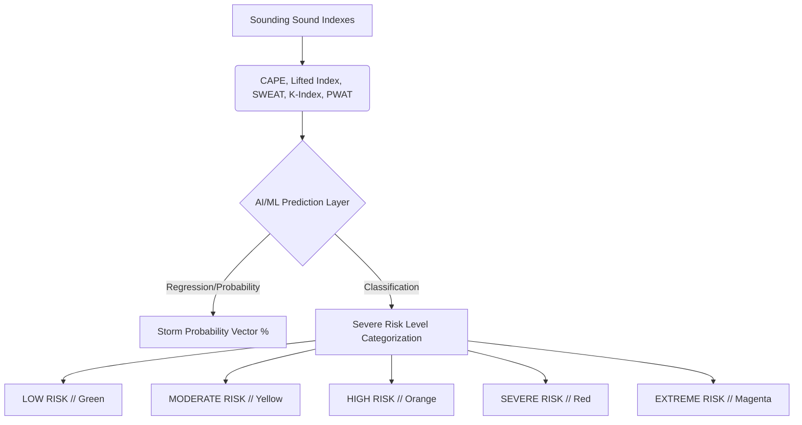
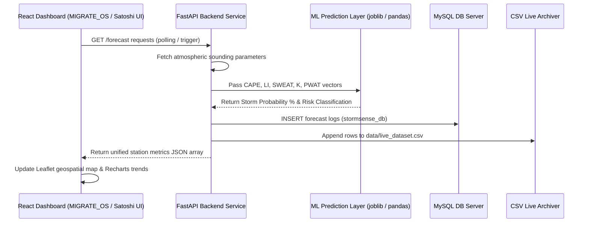

# STORM_SENSE_AI // METEOROLOGICAL SPECIFICATION & ARCHITECTURE SYSTEM

> **Operational Motto:**  
> *“Transforming Atmospheric Intelligence into Actionable Severe Weather Insights.”*

---

## 1. Project Overview & Objective

**StormSense AI** is a state-of-the-art atmospheric intelligence platform engineered for real-time thunderstorm prediction, convective instability tracking, severe weather escalation telemetry, and geospatial hazard mapping. Inspired by meteorological command centers like the **India Meteorological Department (IMD)** and **NASA Space Weather Ops**, it translates complex thermodynamic readings into intuitive, mission-critical decisions.

### Primary Target Sectors:
- **Operational Meteorologists:** High-fidelity sounding data vectors.
- **Disaster Management Agencies:** Automated early warning alerts.
- **Aviation Weather Stations:** Convective boundary layer warnings.
- **Atmospheric Researchers:** Historical index datasets and trend analysis.

---

## 2. Core Meteorological Telemetry

The platform maps and processes five critical convective instability and thermodynamic indices:

| Thermodynamic Index | Meteorological Meaning | Threshold Levels & Warnings |
| :--- | :--- | :--- |
| **CAPE** <br>*(Convective Available Potential Energy)* | Measures buoyancy energy available for ascending air parcels. Crucial for measuring thunderstorm explosive updrafts. | - **< 1000 J/kg**: Stable / Low Risk<br>- **1000 - 2500 J/kg**: Moderate / High Risk<br>- **> 2500 J/kg**: Severe Instability |
| **Lifted Index (LI)** | Evaluates static stability by comparing a lifted parcel’s temp to the environment at 500 hPa. | - **0 to -4**: Moderate Unstability<br>- **-4 to -6**: High Danger<br>- **< -6**: Extreme Convective Risk |
| **SWEAT Index** <br>*(Severe Weather Threat)* | Integrates wind shear and thermodynamic variables to predict severe storm probability and tornadic wind environments. | - **< 200**: No severe storm risk<br>- **200 - 300**: Thunderstorm active<br>- **> 300**: Severe/Explosive cell potential |
| **K Index** | Assesses thunderstorm probability based on vertical temperature lapse rates and mid-level moisture. | - **< 20**: Low occurrence<br>- **20 - 35**: Scattered storm cells<br>- **> 35**: Extreme storm cluster coverage |
| **PWAT** <br>*(Precipitable Water)* | Measures total water vapor in a vertical column. Highly correlated with intense rain rates and flash floods. | - **< 30 mm**: Standard humidity<br>- **30 - 50 mm**: Moderate convective moisture<br>- **> 50 mm**: Heavy local rainfall threat |

---

## 3. Machine Learning Prediction Layer

The StormSense AI Prediction Engine estimates severe weather probability dynamically using thermodynamic inputs:



---

## 4. System Architecture Blueprint

StormSense AI uses a modern, high-density dashboard stack to ensure uninterrupted real-time telemetry:



---

## 5. API Terminal Reference

FastAPI serves JSON payloads dynamically across four main telemetry routes:

### 1. `GET /forecast`
Retrieves live sounding readings, forecast categories, and computed AI probabilities across India's eastern shoreline.
* **Monitored Station Nodes:**
  - **Visakhapatnam** (Station Code: `43150`)
  - **Chennai** (Station Code: `43279`)
  - **Kolkata** (Station Code: `42809`)
  - **Hyderabad** (Station Code: `43128`)
  - **Bhubaneswar** (Station Code: `42971`)

### 2. `GET /history`
Pulls the latest 100 observations stored in the MySQL database, supporting historical regression.

### 3. `GET /trend-analysis`
Outputs differential CAPE variations and instability gradient shifts to identify convective cell acceleration.

### 4. `GET /storm-escalation`
Identifies active boundary-layer ruptures where instability values exceed safety envelopes, triggering critical alarms.

---

## 6. Command Center Design System

The layout combines **Industrial Cyberpunk** high-fidelity density with **Modern Enterprise** status visualization.

### UI Styling Rules:
- **Base Background:** `#0f172a` (slate-950)
- **Panel Surfaces:** `#1e293b` (slate-800) or `rgba(15, 23, 42, 0.5)` with `12px` backdrop blur.
- **High-Density Tables:** 24px rounded corners, with `rgba(30, 41, 59, 0.3)` hover highlights.
- **Pulsing Indicator Dots:** CSS `@keyframes status-pulse 2s infinite` applied to active cells.

### Saturated Risk Matrix:
- **[EXTREME]** `#f43f5e` (Rose Red) — High hazard alert.
- **[SEVERE]** `#f59e0b` (Amber Orange) — Rapid convective developments.
- **[MODERATE]** `#3b82f6` (Neon Blue) — Moderate static instability.
- **[LOW]** `#10b981` (Emerald Green) — Atmospheric columns stabilized.

---

## 7. Operational Resilience & Fallbacks

To ensure command-center grade stability, the frontend and backend include multi-layer error protection:
- **API Offline Mitigation:** If connection to the FastAPI server is interrupted, the React app automatically activates a high-fidelity atmospheric mock simulator. This prevents dashboard layout collapse, keeping Leaflet map plots, Recharts trend charts, and meteorological sounding cards populated.
- **Database Reconnects:** Automatic retries for SQL servers to mitigate query drops.
- **Optional Chaining Safeguards:** Built-in safeguards (`station?.cape || 0`) prevent rendering errors on missing columns.
- **Dynamic directory checks:** Built-in `os.makedirs` path generation secures local CSV log writes.

---

## 8. Future Technology Roadmap

```
   [ WebSockets Streaming ] ──> Enables sub-second telemetry feeds
              │
    [ Real Doppler Overlays ] ──> Integrates spatial radar data layers
              │
    [ GIS Geo-Raster Map ] ──> Advanced multi-region weather forecasting
              │
     [ 3D Convective Volumes ] ──> Immersive vertical atmospheric models
```
